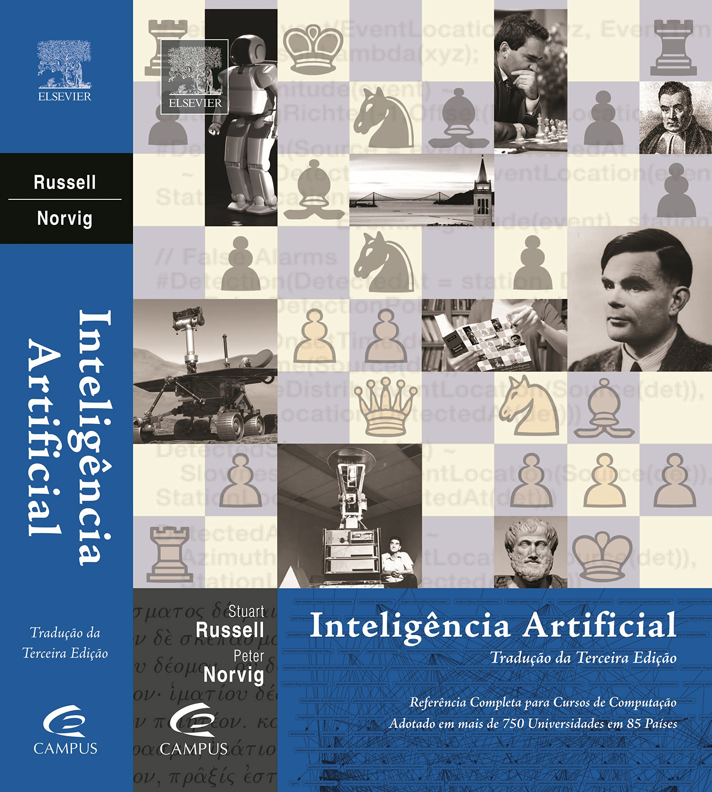
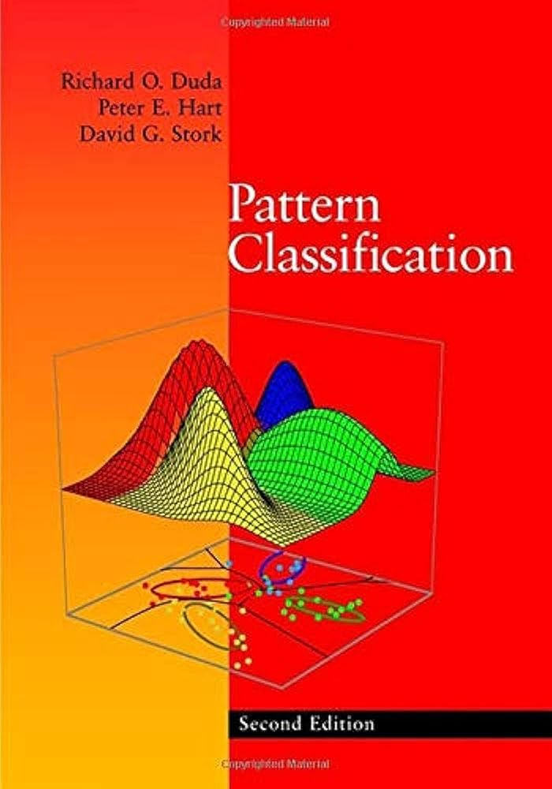
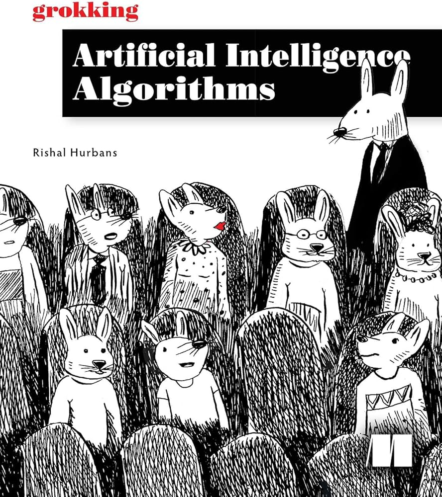
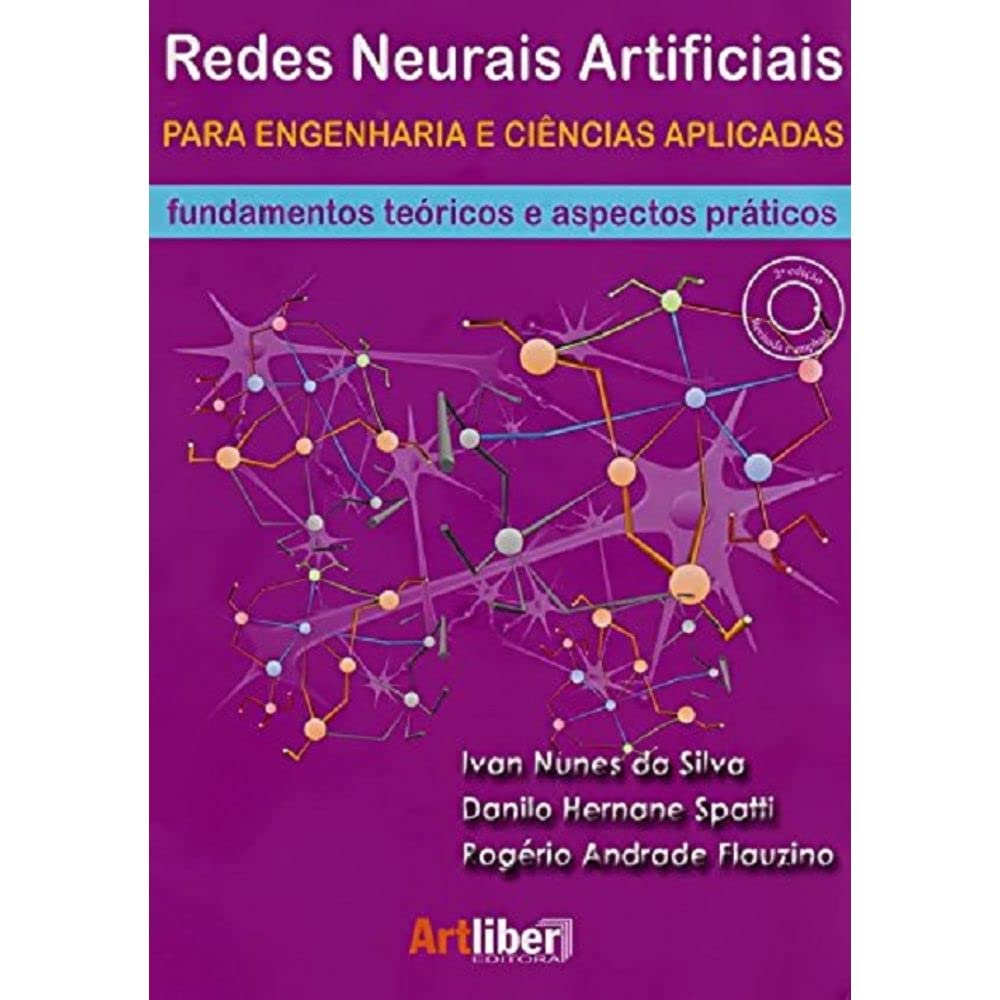
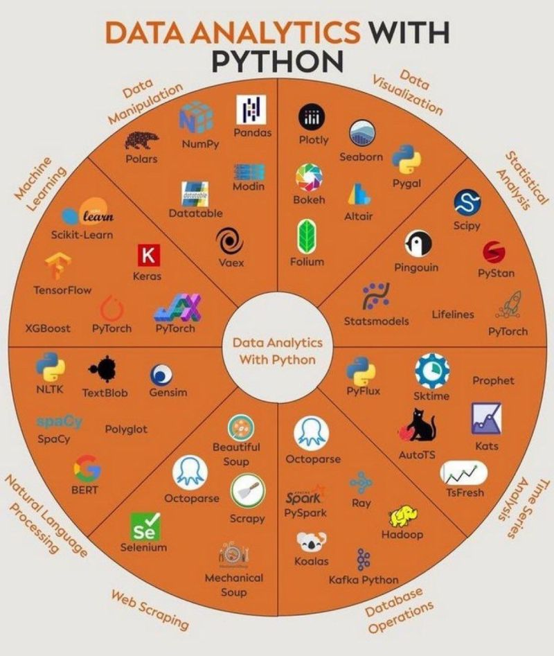
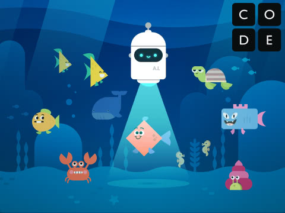
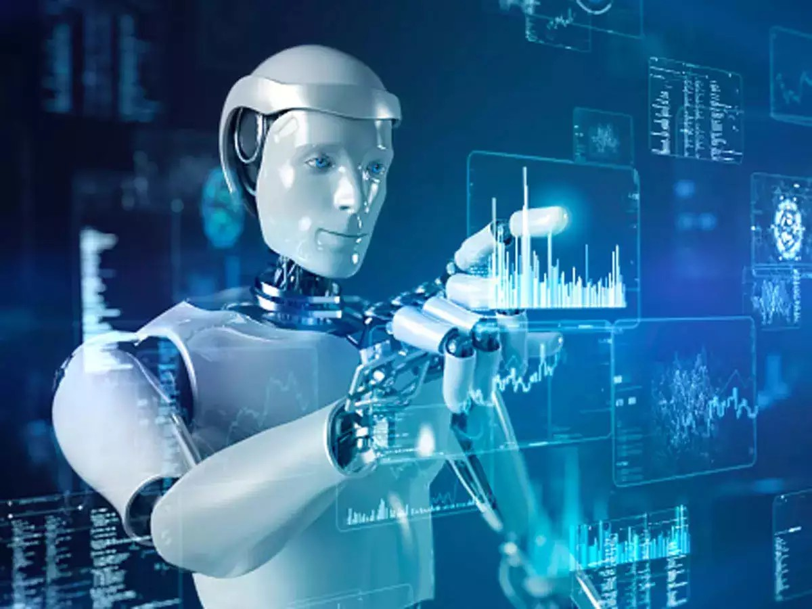
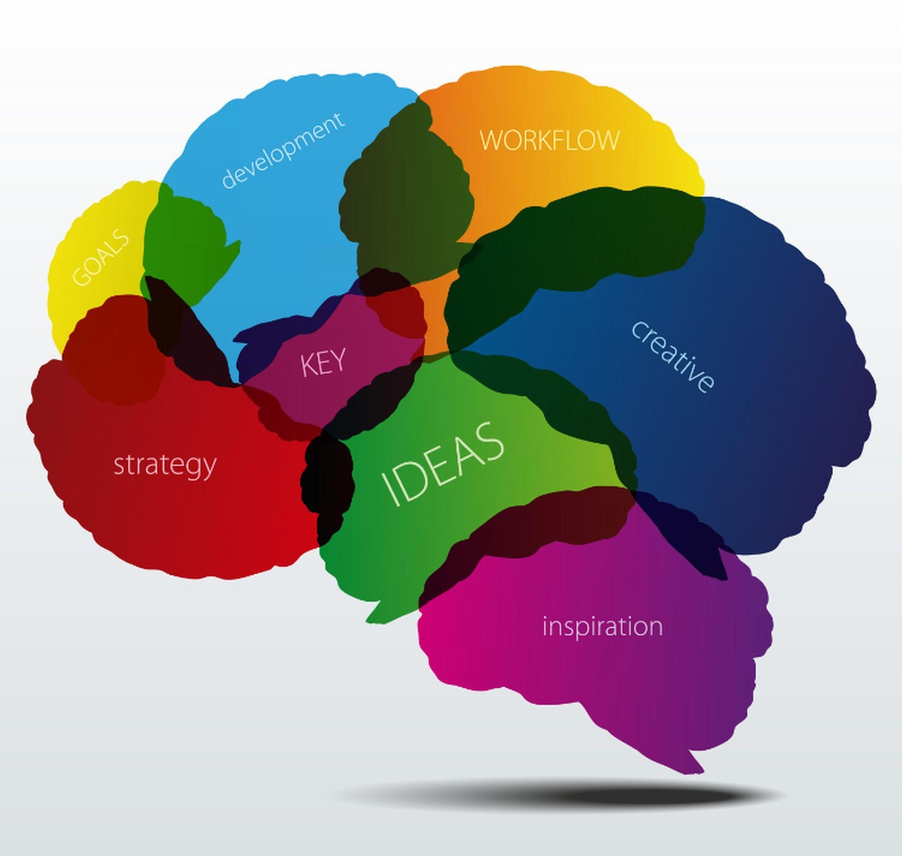
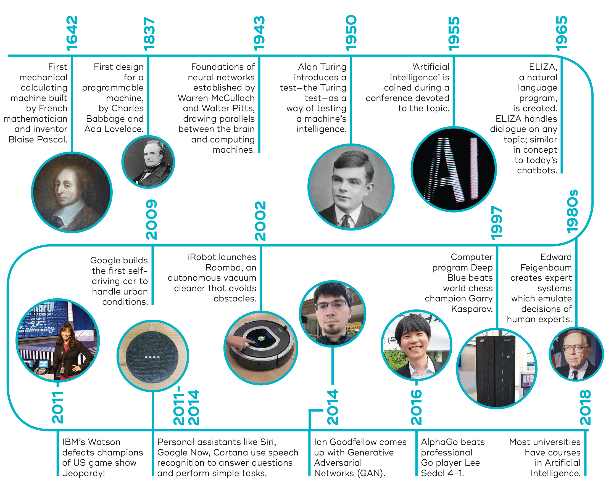
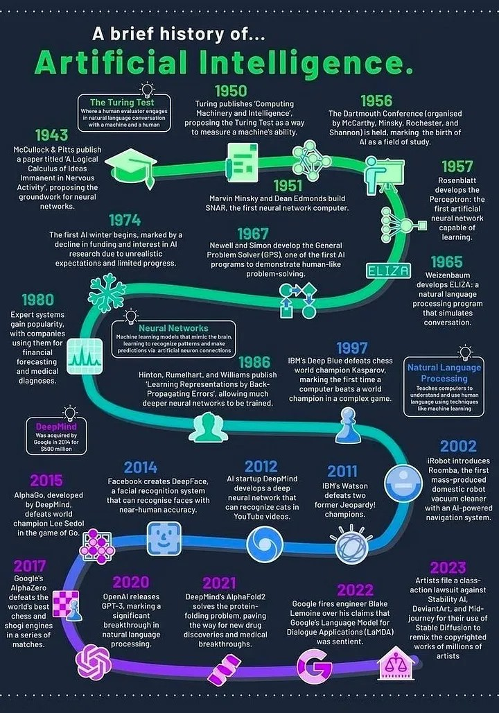

# Apresentação do Professor

## Apresentação do Professor

{fig-align="center" width="70%"}

## Apresentação do Professor

Breve CV: **Matheus Henrique Pimenta Zanon**

- Graduação em Matemática - UTFPR-CP 
  - Estudo - Análise de Sobrevivência;

. . .

- Mestrado em Matemática Aplicada e Computacional - UEL
  - Desenvolvimento de Heurística - Otimização Discreta - Problema da Mochila Compartimentada;
  - Aplicação em Problemas de Corte e Estoque;

. . .

- Doutorado em Bioinformática - UFPR/UTFPR
  - Desenvolvimento de métodos de Machine Learning;
  - Aplicação em Estudos biológicos

## Apresentação do Professor

10 anos de trabalho com informática, sysadmin, Linux e analista de sistemas;

. . .

Consultoria de Machine Learning em empresas como Natura

. . .

Desenvolvimento de softwares de otimização e machine learning (2 Registros INPI)

. . . 

Atualmente é pesquisador pela Universidade de São Paulo (USP-ESALQ) e SB100 FAPESP

## Apresentação do Professor

::: {.center}
**CONTATOS**
:::

- `e-mail`: <omatheuspimenta@outlook.com>
- `LinkedIn`: <https://www.linkedin.com/in/omatheuspimenta>

Qualquer outra rede social: <@omatheuspimenta>

# Apresentação da Disciplina

## Apresentação da Disciplina

{fig-align="center" width="70%"}

## Apresentação da Disciplina

::: {.center}
**AULAS**
:::

Sábado (Síncrono) - Google Meet - 13h às 17h

Durante a semana (Assíncrono) - e-mail

## Apresentação da Disciplina

::: {.center}
**OBJETIVO**
:::

Proporcionar aos alunos a análise e solução de problemas reais da indústria sob a perspectiva da Pesquisa Operacional e **Inteligência Artificial**, contemplando as etapas de modelagem e estruturação matemática do problema, implementação computacional e avaliação da solução. 

. . .

::: {.center}
**EMENTA**
:::

Machine Learning (ML) e Redes Neurais Artificiais: princípios de funcionamento e treinamento dos principais modelos de aprendizado. Implementação dos modelos matemáticos decisórios em Python. Estudos de caso de problemas na indústria implementando algoritmos para predição de variáveis em problemas de classificação e regressão.

# Cronograma

## Cronograma

- [AULA 01] - 08/02/2025 Fundamentos da Inteligência Artificial;
- [AULA 02] - 15/02/2025 Reconhecimentos de Padrões;
- [AULA 03] - 22/02/2025 Redes Neurais Artificiais - Perceptron e Multi Layer Perceptron;
- [AULA 04] - 01/03/2025 Redes Neurais Artificiais - Deep Learning - CNN e RNN (Attention Layer/Encoder Layer ???)
- [AULA 05] - 08/03/2025 Análise de Resultados - Feature Importance - SHAP/DALEX
- [AULA 06] - 15/03/2025 Apresentações e Discussão dos Projetos desenvolvidos

## Bibliografia Recomendada

{fig-align="center" width="30%"}

NORVIG, P.;RUSSEL, S. J. Inteligência Artificial: Uma abordagem moderna. Campus, 2004. 2a Edição

## Bibliografia Recomendada

{fig-align="center" width="30%"}

DUDA, R. O.; HART, P. E.; STORK, D. G. Pattern Classification. 2nd Edition

## Bibliografia Recomendada

{fig-align="center" width="30%"}

HURBANS, R. GROKKING Artificial Intelligence Algorithms. 

## Bibliografia Recomendada

{fig-align="center" width="30%"}

SILVA, da I. N.; SPATTI, D. H.; FLAUZINO, R. A. Redes Neurais Artificiais para Engenharia e Ciências Aplicadas: fundamentos teóricos e aspectos práticos

# Como será a disciplina

## Como será a disciplina

{fig-align="center" width="70%"}

## Como será a disciplina

::: {.center}
**AVALIAÇÃO**

{fig-align="center" width="50%"}
:::

# Avaliação

## PROJETO

- Relatório Técnico contendo:
  - Descrição dos dados;
  - Pré processamento dos dados;
  - Representação gráfica dos dados;
  - Representação das medidas de posição e dispersão dos dados;
  - Descrição do método utilizado;
  - Apresentação dos resultados obtidos - métricas e matrizes de confusão;
  - Discussão dos resultados obtidos - Feature Importance - SHAP values (se possível)
  - Conclusão
- Breve apresentação do Projeto

## PROJETO

::: {.center}
{fig-align="center" width="50%"}

{fig-align="center" width="50%"}
:::

## PROJETO

::: {.center}
**Datasets Online**
:::

1. Kaggle - <https://www.kaggle.com>
2. UCI Machine Learning Repository - <https://archive.ics.uci.edu/>
3. Data.gov - <https://www.data.gov>
4. World Bank Data - <https://data.worldbank.org>
5. OpenDataSoft - <https://public.opendatasoft.com/explore>
6. Data.gov.uk - <https://data.gov.uk>
7. Eurostat - <https://ec.europa.eu/eurostat/data/database>
8. Data.world - <https://data.world>
9. FiveThirtyEight - <https://data.fivethirtyeight.com/>

## PROJETO

10. GOV.UK - <https://data.gov.uk>
11. United Nations Data - <https://data.un.org>
12. Amazon Web Services (AWS) Public Datasets - <https://registry.opendata.aws/>
13. Data.gov.au - <https://data.gov.au>
14. Quandl - <https://www.quandl.com>
15. KDNuggets - <https://www.kdnuggets.com/datasets>
16. Harvard Dataverse - <https://dataverse.harvard.edu/>
17. Data.gouv.fr - <https://www.data.gouv.fr/fr/>
18. Google Public Datasets - <https://cloud.google.com/datasets>

## PROJETO

19. Awesome Public Datasets (GitHub) - <https://github.com/awesomedata/awesome-public-datasets>
20. Base dos Dados - <https://basedosdados.org/>
21. Gov BR Dados - <https://dados.gov.br/>

## PROJETO

::: {.center}
**Algumas bibliotecas Python**
:::

1. **Manipulação de Dados**
   - **NumPy**: Uma biblioteca para processamento de dados numéricos.
   - **Pandas**: Uma biblioteca para gerenciamento e análise de dados.
   - **Polars**: Uma biblioteca para gerenciar e analisar dados rapidamente.
   - **Modin**: Uma biblioteca para acelerar o processamento de dados usando Pandas.
   - **Datatable**: Uma biblioteca para processar grandes volumes de dados.
   - **Vaex**: Uma biblioteca para processar grandes volumes de dados rapidamente.

## PROJETO

2. **Visualização de Dados**
   - **Matplotlib**: Biblioteca "padrão" para visualizações gráficas.
   - **Plotly**: Uma biblioteca para visualizações gráficas interativas.
   - **Seaborn**: Uma biblioteca para visualizações estatísticas.
   - **Bokeh**: Uma biblioteca para visualizações gráficas interativas.
   - **Altair**: Uma biblioteca para visualizações gráficas simples e interativas.
   - **Pygal**: Uma biblioteca para criar gráficos interativos.
   - **Folium**: Uma biblioteca para criar mapas interativos.

## PROJETO

3. **Análise Estatística**
   - **Scipy**: Uma biblioteca para cálculos científicos.
   - **Statsmodels**: Uma biblioteca para modelos estatísticos.
   - **Pingouin**: Uma biblioteca para estatísticas simples.
   - **PyStan**: Uma biblioteca para modelos estatísticos.
   - **Lifelines**: Uma biblioteca para análise de sobrevivência.
   - **PyFlux**: Uma biblioteca para análise de séries temporais estatísticas.
   - **Sktime**: Uma biblioteca para análise de séries temporais.
   - **Prophet**: Uma biblioteca para previsão de séries temporais.

## PROJETO

3. **Análise Estatística**
   - **Kats**: Uma biblioteca para análise e previsão de séries temporais.
   - **AutoTS**: Uma biblioteca para previsão automática de séries temporais.
   - **TsFresh**: Uma biblioteca para extração de características de séries temporais.
   - **Darts**: Uma biblioteca para previsão de séries temporais.

## PROJETO

4. **Operações com Banco de Dados**
   - **PySpark**: Uma biblioteca para processamento de grandes volumes de dados.
   - **Ray**: Uma biblioteca para computação distribuída.
   - **Hadoop**: Um framework para processamento de grandes volumes de dados.
   - **Koalas**: Uma biblioteca que utiliza interfaces Pandas no Spark.
   - **Kafka**: Uma biblioteca para lidar com Apache Kafka.

## PROJETO

5. **Extração de Dados (Web Scraping)**
   - **Beautiful Soup**: Uma biblioteca para extrair dados de arquivos HTML e XML.
   - **Octoparse**: Uma ferramenta para extração de dados sem necessidade de programação.
   - **Scrapy**: Um framework para extração de dados.
   - **Mechanical Soup**: Uma biblioteca para navegar na web e extrair dados.
   - **Selenium**: Um framework para testar interfaces de usuário e extrair dados.

## PROJETO

6. **Processamento de Linguagem Natural**
   - **NLTK**: Biblioteca de Processamento de Linguagem Natural.
   - **TextBlob**: Biblioteca para Processamento de Texto.
   - **Gensim**: Biblioteca para Modelagem de Tópicos e Análise de Texto.
   - **spaCy**: Biblioteca de Processamento de Linguagem Natural.
   - **Polyglot**: Biblioteca com Suporte Multilíngue.
   - **BERT**: Modelo de Aprendizado Profundo para Processamento de Linguagem Natural.

## PROJETO

7. **Aprendizado de Máquina**
   - **Scikit-Learn**: Biblioteca de Aprendizado de Máquina.
   - **Keras**: Biblioteca para Construção de Redes Neurais.
   - **TensorFlow**: Framework de Aprendizado de Máquina.
   - **XGBoost**: Biblioteca de Aprendizado de Máquina Reforçado.
   - **PyTorch**: Framework de Aprendizado Profundo.
   - **PyTorch Lightning**: Um Framework para Facilitar a Construção de Modelos de Aprendizado Profundo.
   - **TabICLv2**: Uma biblioteca para modelos de aprendizado profundo em dados tabulares.

## PROJETO

::: {.center}
**Outras bibliotecas Python**
:::

- **YellowBrick:** Suíte de visualização e ferramentas de diagnósticos para a seleção de modelos rapidamente;
- **PyCaret:** Workflows de Machine Learning com codeless;
- **imbalanced-learn:** Variedade de métodos para lidar com classes desbalanceadas;
- **SHAP:** Explicabilidade de modelos com poucas linhas de código;
- **missingno:** Visualização de valores faltantes de maneira fácil;
- **prophet:** Biblioteca para análise de dados temporais;
- **parallel-pandas:** Paralelizar biblioteca pandas de maneira fácil;
- **featuretools:** Engenharia de features automatizadas para modelos de ML;
- **lazypredict:** Treine 30 modelos de ML em poucas linhas de código;
- **mlxtend:** Coleção de funções utilitárias para processamento, avaliação e visualização de modelos de ML;

## PROJETO

- **sweetviz:** Visualização de relatórios em poucas linhas de código;
- **skorch:** PyTorch + sklearn;
- **faiss:** Análise de similaridade em segundos (by Meta);
- **category-encoders:** Data encoder para dados categóricos;

## PROJETO

::: {.center}
{fig-align="center" width="45%"}
:::

## Como será a disciplina

::: {.center}
**Curso e Materiais**

{fig-align="center" width="20%"}

<http://moodle.utfpr.edu.br>
:::

- Materiais didáticos;
- Notas;
- Avisos;
- Aulas gravadas;

## Como será a disciplina

::: {.center}
**Brincar e Aprender**

{fig-align="center" width="50%"}

<https://code.org/oceans>
:::

# Fundamentos da Inteligência Artificial

## Introdução - Breve e Geral

{fig-align="center" width="70%"}

. . .

::: {.center}
**NÃO É TRIVIAL MODELAR E ANALISAR DADOS!!!!!!**
:::

## Inteligência

{fig-align="center" width="30%"}

Pode ser definida como a capacidade de:

- planejar;
- raciocinar;
- resolver problemas;

## Inteligência

{fig-align="center" width="30%"}

Pode ser definida como a capacidade de:

- planejar;
- raciocinar;
- **resolver problemas**;
- compreender ideias e linguagens;
- abstrair ideias;
- aprender

## Inteligência

A ciência que conhecemos hoje surgiu pós 2ª Guerra Mundial;  
"Inteligência Artificial" obteve esse nome após 1955;  
Possui vários campos e aplicações:

- aprendizado de máquina;
- agentes inteligentes;
- sistemas especialistas;
- processamento de linguagem natural;
- *deep learning*;

## Inteligência

{#fig-aitime1 fig-align="center" width="70%"}

## Inteligência

ELIZA today: <https://www.masswerk.at/elizabot/>

. . .

Teste de Turing hoje já foi "vencido" por diversas IA. Alguns pesquisadores dizem que é "antigo" para as IAs de hoje.

Teste de Turing exige capacidades de:

- Processamento de linguagem natural;
- Representação do conhecimento;
- Raciocínio automatizado;
- Aprendizagem de máquina;

## Inteligência

{fig-align="center" width="50%"}

## Inteligência

Origem no Latim:

*Inter* (entre) e *Legere* (escolher)

. . .

Habilidade de realizar, de forma eficiente, uma determinada tarefa;

. . .

*Artificiale*

Algo que não é natural, ou seja, produzido pelo homem.

. . .

É um tipo de inteligência produzida pelo homem para atribuir às máquinas algum tipo de habilidade que simula a inteligência do homem.

. . .

Ou ainda:

## Inteligência

Ramo da ciência da computação que lida com a automação do pensamento e comportamento inteligente

## Inteligência Artificial

"Se a inteligência artificial é a nova eletricidade, *big data* é o combustível dos geradores"

Kai-Fu Lee

## Inteligência Artificial

Inteligência Artificial encorpora conhecimentos de diversas áreas:

::: {.incremental}
- Matemática;
- Sociologia;
- Psicologia;
- Computação;
- Engenharias;
- Genética;
- Neurofisiologia;
- Linguística;
- Filosofia;
:::

## Inteligência Artificial

- IA forte: (utópica??) pesquisadores acreditam que ao dispor de um computador com super processamento e fornecendo o suficiente de "inteligência" poderá ser construído "consciência" como um ser humano;

. . .

Já temos algumas 'fagulhas' do que é definido como *AGI - Artificial general intelligence*, que é uma inteligência artificial que iguala ou supera as capacidades cognitivas humanas em uma ampla gama de tarefas cognitivas.

- IA fraca: (estamos aqui ainda!) problemas que exigem um comportamento inteligente podem ser modelados usando computação e assim obter soluções de problemas complexos!

## Inteligência Artificial

IA foca em:

- domínio ou tarefa com objetivo específico;
  - carro autônomo;
  - tradução de textos;
  - classificação de e-mail;
  - classificação de imagens;
  - identificação de imagens;
  - entre outros...

## Desafios na Ciência de Dados

{fig-align="center" width="70%"}

## Desafios na Ciência de Dados

::: {.incremental}
- Como obter os dados;
- A qualidade dos dados obtidos;
- Entender o que os dados podem nos contar;
:::

## Desafios na Ciência de Dados

::: {.incremental}
- **Definição do Problema**
- **Coleta de Dados** Seu modelo é tão bom quanto seus dados.
- **Limpeza dos Dados** Ninguém gosta dessa etapa que representa 80% do trabalho. Dados limpos = resultados confiáveis.
- **Engenharia de Features** A arte de transformar dados brutos em ouro. É aqui que a experiência faz toda diferença.
- **Seleção de Features** Menos é mais! Escolher as características certas é melhor que usar todas possíveis.
- **Preparação dos Dados** Split train/val/test - o tripé sagrado que vai validar seu trabalho.
:::

## Desafios na Ciência de Dados

::: {.incremental}
- **Construção e Avaliação do Modelo** Finalmente chegamos na parte "divertida"! Mas note: é só uma parte do processo.
- **Deployment** Hora de colocar seu modelo no mundo real. Aqui descobrimos se ele realmente resolve o problema.
- **Monitoramento e Retraining** O trabalho nunca acaba! Modelos precisam de manutenção constante.
:::

## Ciência de Dados

{fig-align="center" width="85%"}

## Ciência de Dados

Modelagem dos dados, estrutura e armazenamento 

. . .

*Engenharia de Dados*

Análise e visualização dos dados 

. . .

*Data Science e Inteligência Artificial*

. . .

::: {.center}
Dados $\rightarrow$ Conhecimento $\rightarrow$ Decision-maker
:::

## Visualização de Dados

{fig-align="center" width="100%"}

# Alguns Estudos de Caso

## Estudos de Caso

::: {.incremental}
- Previsão de Risco de Crédito para Bancos;
- Predição de refugo das peças em produção;
- Monitoramento de mídias sociais;
- Análise de mutações em genomas;
- Classificação da temperatura nos processos de mistura e aquecimento em uma planta industrial;
- Classificação de gêneros musicais;
- Predição de valores de alugueis;
- E muitos outros ...
:::

## Conhecendo o Google Colab

- Google Colab (Colaboratory) é um ambiente de programação online gratuito.
- Baseado no Jupyter Notebook, permite executar código Python diretamente no navegador.
- Não requer instalação ou configuração: tudo funciona na nuvem.
- Ideal para aprendizado de máquina, ciência de dados e prototipação rápida.

## Benefícios do Google Colab

- **Gratuito:** Disponível para qualquer usuário com uma conta Google.
- **Acesso a GPUs e TPUs:** Execute códigos mais rápidos com recursos de hardware avançado.
- **Colaboração:** Compartilhe notebooks e trabalhe em equipe em tempo real.
- **Armazenamento na Nuvem:** Salve seus notebooks no Google Drive.
- **Suporte a Bibliotecas ML/DS:** Pré-configurado com muitas bibliotecas populares como TensorFlow, PyTorch, NumPy, Pandas, entre outras.

## Utilidades do Google Colab

- **Ensino:** Ferramenta excelente para ensinar ou aprender Python e ciência de dados.
- **Prototipagem Rápida:** Experimente novos modelos de aprendizado de máquina.
- **Visualização de Dados:** Crie gráficos interativos usando bibliotecas como Matplotlib e Plotly.
- **Análise de Dados:** Processamento e análise de grandes conjuntos de dados.

## Como Funciona?

1. **Criação de Notebooks:** Comece criando um novo notebook no Google Drive.
2. **Execução de Código:** Escreva e execute código Python célula por célula.
3. **Armazenamento de Arquivos:** Faça upload de arquivos ou conecte-se ao Google Drive.
4. **Hardware Avançado:** Habilite GPUs/TPUs em "Ambiente de Execução".
5. **Compartilhamento:** Compartilhe o notebook com outras pessoas, similar ao Google Docs.

## Exemplos de Aplicações

- Treinamento de modelos de aprendizado de máquina.
- Análise e visualização de dados para ciência de dados.
- Construção de pipelines de pré-processamento.
- Experimentação com novas bibliotecas e frameworks.
- Desenvolvimento de projetos colaborativos de pesquisa.

## Recursos e Limitações

**Recursos:**

- Acesso a GPUs/TPUs de alta performance.
- Ambiente interativo fácil de usar.

 

**Limitações:**

- Tempo limite de execução para sessões (12 horas no máximo).
- Dependente de conexão à internet.
- Restrições de memória e armazenamento na nuvem.

## Dúvidas? {background-color="#f1c40f"}

::: {.center}
Matheus Pimenta

<omatheuspimenta@outlook.com>
:::
