# Reconhecimento de Padrões

## O que é Reconhecimento de Padrões?

**Definições formais:** <!--[cite: 3] -->

> "É uma área de pesquisa que tem por objetivo a classificação de objetos (padrões) em um número de categorias ou classes" — *Theodoridis and Koutroumbas, 2008* <!--[cite: 3] -->

. . .

> "O ato de observar os dados brutos e tomar uma ação baseada na categoria de um padrão" — *Duda et al., 2001* <!--[cite: 3] -->

. . .

*Contexto na Manutenção:* O "padrão" pode ser a assinatura vibracional de um motor rotativo, e a "ação" é a decisão de intervir antes de uma falha catastrófica. <!--[cite: 3] -->

## Definições Essenciais

::: {.incremental}
- **Padrão:** É uma entidade, objeto, processo ou evento, vagamente definido, que pode assumir um nome. <!--[cite: 3] -->
- **Classe:** Conjunto de padrões que possuem características em comum (ex: *Operação Normal*, *Falha Iminente*). <!--[cite: 3] -->
- **Característica ou Atributo:** Dado extraído de uma amostra por meio de medida e/ou processamento. Geralmente organizados em um vetor de características $\mathbf{x}$. <!--[cite: 3] -->
- **Classificação:** O ato de atribuir classes às amostras, baseado exclusivamente em suas características. <!--[cite: 3] -->
- **Ruído:** Distorção, falha ou imprecisão na aquisição dos dados (fenômeno comum em sensores industriais de chão de fábrica). <!--[cite: 3] -->
:::

## Modelos Classificadores

**Classificadores** são algoritmos utilizados para categorizar ou descrever padrões a partir de um conjunto de propriedades matemáticas ou estruturais. <!--[cite: 3] -->

. . .

Eles se dividem primariamente em dois grandes grupos: <!--[cite: 3] -->

1. **Classificação Supervisionada** <!--[cite: 3] -->
2. **Classificação Não Supervisionada** <!--[cite: 3] -->

## Classificação Supervisionada

::: {.incremental}
- Ocorre quando selecionamos **amostras representativas e já rotuladas** para cada uma das classes que desejamos prever. <!--[cite: 3] -->
- Nós conhecemos os padrões e as classes que estamos procurando (temos o "gabarito" histórico). <!--[cite: 3] -->
- É o coração do chamado **Aprendizado Supervisionado** (ex: treinar um modelo com um banco de dados de falhas mecânicas já documentadas). <!--[cite: 3] -->
:::

## Classificação Não Supervisionada

::: {.incremental}
- Não conhecemos o padrão de antemão, nem o número total de categorias a serem descobertas. <!--[cite: 3] -->
- É amplamente conhecido como análise de agrupamentos ou **Clusterização (*Clustering*)**. <!--[cite: 3] -->
- O algoritmo particiona o conjunto de dados em grupos, baseando-se em afinidades métricas, garantindo que: <!--[cite: 3] -->
  - Os pontos dentro de um mesmo grupo (*cluster*) sejam **altamente similares** entre si. <!--[cite: 3] -->
  - Os pontos de grupos diferentes sejam **altamente dissimilares**. <!--[cite: 3] -->
:::

## Exemplos de Aplicações

| **Aplicação (Geral e Industrial)** | **Padrão de Entrada** | **Classes (Saída)** |
|:---|:---|:---|
| Manutenção Preditiva | Dados de vibração/temperatura | Operação Normal / Alerta de Falha |
| Reconhecimento de caracteres | Imagem de um documento | Caracteres ou Palavras |
| Seleção de qualidade industrial | Imagem em esteira de produção | Níveis de conformidade da peça |
| Diagnóstico auxiliado | Imagem microscópica / Raio-X | Saudável / Anômalo |
| Detecção de fraudes | Transações financeiras | Fraude / Não fraude |
| Filtro de e-mails | Corpo do E-mail | Spam / Inbox |
| Reconhecimento de fala | Áudio contendo voz humana | Texto correspondente transcrito |

: Tabela adaptada de cenários práticos de Inteligência Artificial. <!--[cite: 3] -->

# Etapas do Reconhecimento de Padrões

## Pipeline de Reconhecimento de Padrões

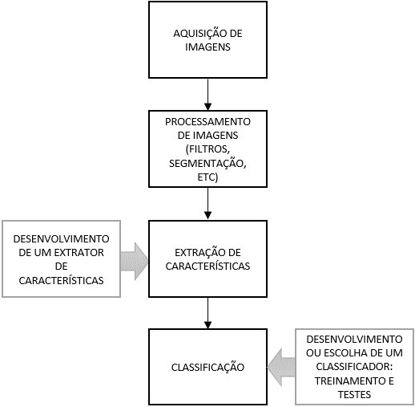{fig-align="center" width="50%"} <!--[cite: 3] -->

## 1. Obtenção dos Dados

A coleta de dados é a base de todo o processo de predição: <!--[cite: 3] -->

::: {.incremental}
- **Sensores e IoT (Internet of Things):** Essencial na Indústria para monitorar peso, temperatura, umidade, vibração e velocidade em tempo real. <!--[cite: 3] -->
- **Dispositivos de Imagem e Som:** Câmeras de vigilância, microfones acústicos para escuta de rolamentos, satélites, escâneres e esteiras de produção. <!--[cite: 3] -->
- **Dados Laboratoriais e Biomédicos:** Sequenciadores genômicos, hemogramas, medições químicas de qualidade da água/óleo. <!--[cite: 3] -->
:::

## 2. Pré-processamento: Limpeza

O pré-processamento garante que os dados cheguem com qualidade ao modelo: <!--[cite: 3] -->

::: {.incremental}
- **Identificação e remoção de problemas:** <!--[cite: 3] -->
  - Amostras com **pouca variância** (não ajudam o modelo a discernir padrões). <!--[cite: 3] -->
  - Amostras com **alta correlação** (redundância de informações que causa peso excessivo). <!--[cite: 3] -->
  - Tratamento de **ausência de dados** (valores *null*, *NaN* ou falhas pontuais do sensor). <!--[cite: 3] -->
:::

## 2. Pré-processamento: Normalização

Algoritmos baseados em distância são extremamente sensíveis à magnitude. Faz-se necessário aplicar: <!--[cite: 3] -->

::: {.incremental}
- **Padronização (Z-Score):** Centraliza a média em 0 e estabelece a variância: <!--[cite: 3] -->
  $$ x' = \frac{x - \mu}{\sigma^2} $$ <!--[cite: 3] -->
  *(Onde $\mu$ é a média e $\sigma^2$ é a variância/desvio)* <!--[cite: 3] -->
- **Transformação Logarítmica ($\log_2$ ou $\ln$):** Útil para reduzir distorções entre grandezas muito variadas. <!--[cite: 3] -->
:::

## 2. Pré-processamento: Normalização

- **Reescala Min-Max (Intervalo $[0,1]$):** <!--[cite: 3] -->
  $$ x' = \frac{x - \min(x)}{\max(x) - \min(x)} $$ <!--[cite: 3] -->

 . . .

  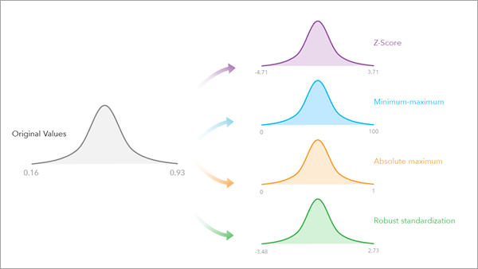{fig-align="center"}

## Distância Matemáticas - Definição

Para classificar padrões, precisamos medir a "distância" entre duas amostras no espaço $S$. Para uma métrica ser matematicamente válida, $d(a, b)$ deve satisfazer: <!--[cite: 3] -->

::: {.incremental}
1. **Não negatividade:** A distância não pode ser negativa. <!--[cite: 3] -->
   $$ d(a, b) \geq 0, \quad \forall a, b \in S $$ <!--[cite: 3] -->
2. **Comutatividade (Simetria):** A ordem de medição não altera o valor. <!--[cite: 3] -->
   $$ d(a, b) = d(b, a) $$ <!--[cite: 3] -->
3. **Desigualdade triangular:** O caminho direto é sempre o mais curto. <!--[cite: 3] -->
   $$ d(a, b) + d(b, c) \geq d(a, c) $$ <!--[cite: 3] -->
:::

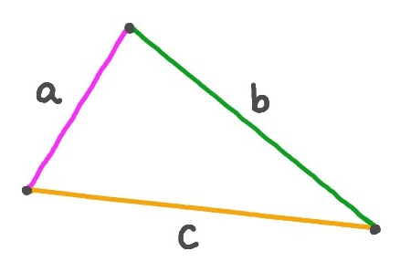{fig-align="center" width="20%"} <!--[cite: 3] -->

## Panorama das Distâncias

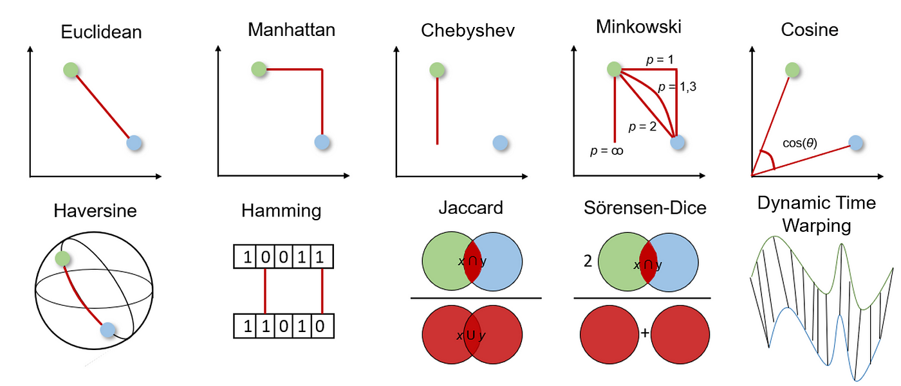{fig-align="center" width="100%"} <!--[cite: 3] -->

## Distância Euclidiana

Mede a separação geométrica "em linha reta" entre dois vetores $\mathbf{x}$ e $\mathbf{y}$ no espaço $\mathbb{R}^n$: <!--[cite: 3] -->

$$ d_E(\mathbf{x}, \mathbf{y}) = \sqrt{\sum_{i=1}^n (x_i - y_i)^2} $$ <!--[cite: 3] -->

. . .

**Características principais:** <!--[cite: 3] -->

- Atribui rigorosamente a **mesma importância** a cada dimensão ou *feature*. <!--[cite: 3] -->
- Altamente sensível a diferenças de escala (variáveis de magnitude na ordem dos milhares dominarão o cálculo se não houver normalização prévia). <!--[cite: 3] -->

## Distância City-Block (Manhattan)

Também conhecida como norma $L_1$ ou *Taxicab*. Avalia a distância percorrida em "quadras" ortogonais em $\mathbb{R}^n$: <!--[cite: 3] -->

$$ d_C(\mathbf{x}, \mathbf{y}) = \sum_{i=1}^n |x_i - y_i| $$ <!--[cite: 3] -->

. . .

**Características principais:** <!--[cite: 3] -->

- Calcula a soma das diferenças absolutas entre os componentes. <!--[cite: 3] -->
- É matematicamente **menos sensível a *outliers*** severos se comparada à Euclidiana (pois não eleva diferenças ao quadrado). <!--[cite: 3] -->
- Excelente para variáveis que descrevem deslocamentos restritos a eixos. <!--[cite: 3] -->

## Distância de Minkowski

Uma generalização matemática das métricas de distância através da introdução do fator $p$: <!--[cite: 3] -->

$$ d_{Mi}(\mathbf{x}, \mathbf{y}) = \left[ \sum_{i=1}^n |x_i - y_i|^p \right]^{\frac{1}{p}} $$ <!--[cite: 3] -->

. . .

**Configurações Clássicas:** <!--[cite: 3] -->

- Se **$p = 1$**: Recuperamos a Distância Manhattan. <!--[cite: 3] -->
- Se **$p = 2$**: Recuperamos a Distância Euclidiana. <!--[cite: 3] -->
- Se **$p \to \infty$**: Obtemos a Distância de Chebyshev (avalia apenas a dimensão com a diferença máxima). <!--[cite: 3] -->

## Distância de Minkowski

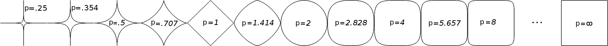{fig-align="center" width="100%"} <!--[cite: 3] -->

## Distância de Mahalanobis

Avança em relação à geometria básica e insere a noção de **covariância e estrutura dos dados** no cálculo: <!--[cite: 3] -->

$$ d_{Ma}(\mathbf{x}, \mathbf{y}) = \sqrt{(\mathbf{x} - \mathbf{y})^T \Sigma^{-1} (\mathbf{x} - \mathbf{y})} $$ <!--[cite: 3] -->

*Onde $\Sigma$ é a matriz de covariância e $\Sigma^{-1}$ sua inversa.* <!--[cite: 3] -->

. . .

**Características principais:** <!--[cite: 3] -->

- Considera tanto a variância individual quanto a **correlação estatística** entre as variáveis. <!--[cite: 3] -->
- Atribui pesos dinâmicos para dimensões diferentes, tornando o cálculo **invariante a escalas**. É excepcional para reconhecer anomalias (muito útil em chão de fábrica). <!--[cite: 3] -->

## Exemplos Visuais de Distância

::: {layout-ncol=2}
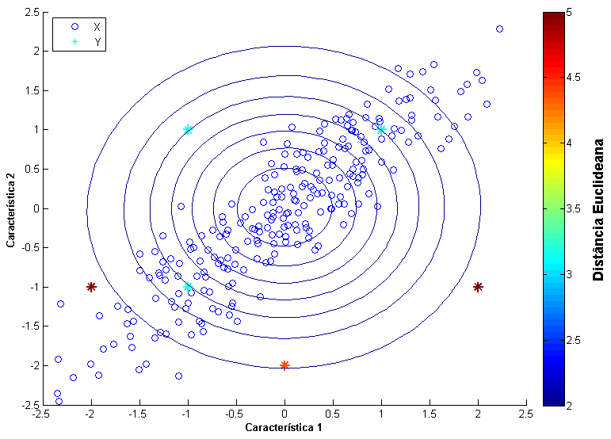{fig-align="center" width="100%"} <!--[cite: 3] -->

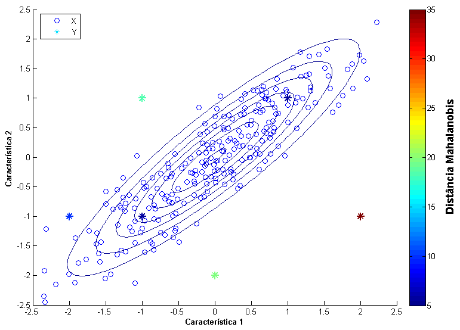{fig-align="center" width="100%"} <!--[cite: 3] -->
:::

*Comparativo visual de fronteiras de decisão usando distâncias. <!--[cite: 3] -->*

# Knowledge Discovery in Databases (KDD)

## Descoberta do Conhecimento em Dados (KDD)

O KDD não é apenas rodar um modelo; é a estruturação científica completa para extrair informações reais a partir de bases de dados brutas na engenharia e nos negócios. <!--[cite: 3] -->

. . .

**As 4 Etapas Core do KDD:** <!--[cite: 3] -->

1. **Definição de objetivos:** Compreender o problema (ex: Qual máquina vai falhar e por quê?). <!--[cite: 3] -->
2. **Seleção da Base:** Extração inteligente e integração de dados relevantes dos CLPs, ERPs e sensores. <!--[cite: 3] -->
3. **Limpeza e Preparação:** Remoção de ruídos, tratamento de nulos, descarte de registros duplicados e transformações essenciais. <!--[cite: 3] -->
4. **Análise Preditiva:** Aplicação matemática das heurísticas de Regressão, Classificação ou Agrupamento. <!--[cite: 3] -->

## A Realidade dos Dados Brutos

Na indústria, os dados nunca chegam prontos. Eles chegam assim: <!--[cite: 3] -->

::: {layout-ncol=3}
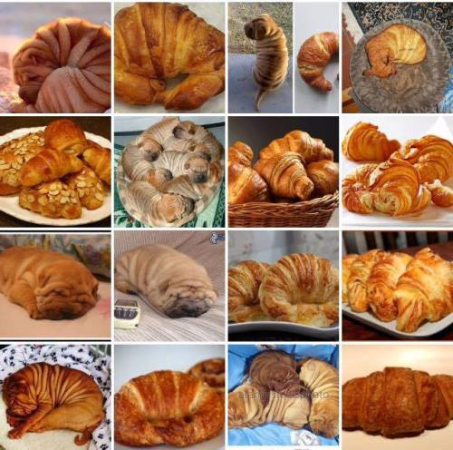{fig-align="center" width="63%"} <!--[cite: 3] -->

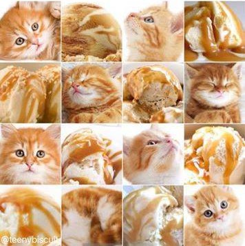{fig-align="center" width="63%"} <!--[cite: 3] -->

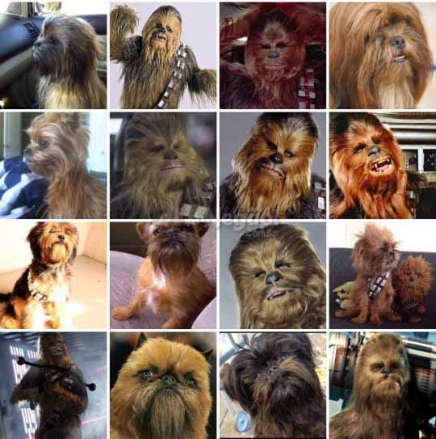{fig-align="center" width="63%"} <!--[cite: 3] -->

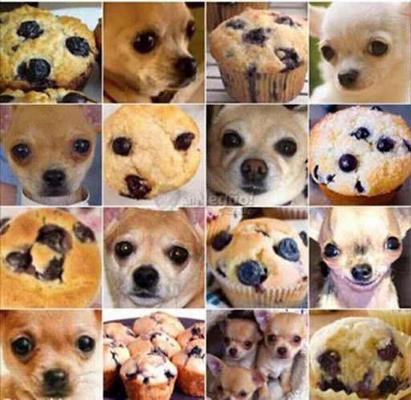{fig-align="center" width="63%"} <!--[cite: 3] -->

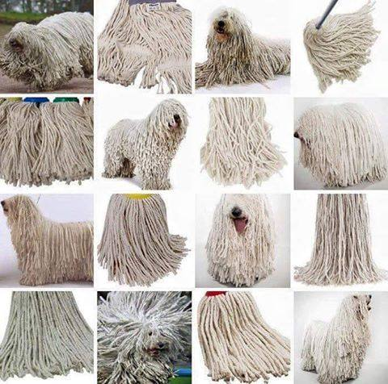{fig-align="center" width="63%"} <!--[cite: 3] -->

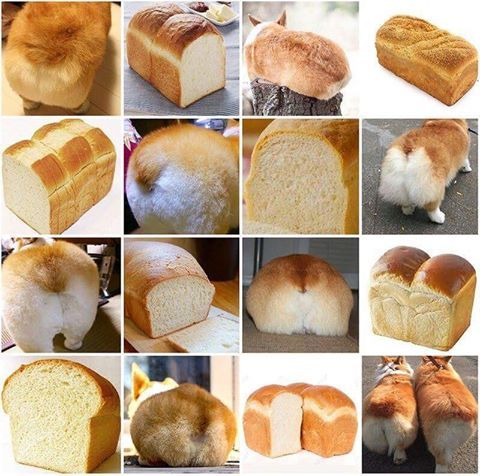{fig-align="center" width="63%"} <!--[cite: 3] -->
:::

## A Realidade dos Dados Brutos

::: {layout-ncol=2}
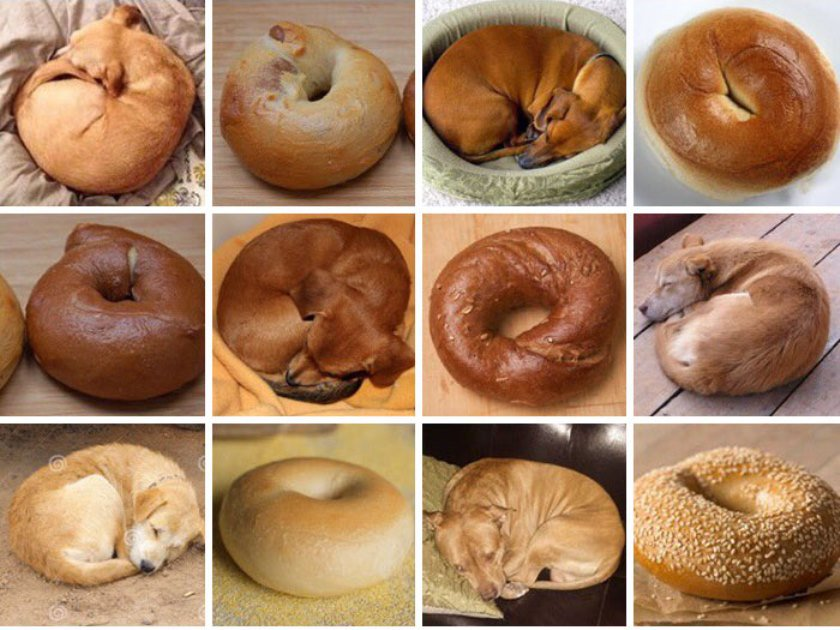{fig-align="center" width="55%"} <!--[cite: 3] -->

{fig-align="center" width="55%"} <!--[cite: 3] -->

{fig-align="center" width="55%"} <!--[cite: 3] -->

{fig-align="center" width="55%"} <!--[cite: 3] -->
:::

## Por Que Precisamos de Modelos Inteligentes?

A IA surge da necessidade de processos autônomos em tarefas altamente dimensionais e complexas: <!--[cite: 3] -->

::: {.incremental}
- **Redução de Intervenção Humana:** Diminuir a dependência de análises exaustivas feitas por especialistas locais. <!--[cite: 3] -->
- **No Diagnóstico Médico (ou Industrial):** Sintomas (ou vibrações físicas) apresentam alta variabilidade e combinações caóticas. O modelo identifica a doença (ou falha) aprendendo sistematicamente com exemplos passados. <!--[cite: 3] -->
- **Estratégia e Vendas:** "Quais peças sobressalentes saem em conjunto do almoxarifado?" Padrões ocultos nos dados operacionais guiam a eficiência dos estoques. <!--[cite: 3] -->
:::

## Motivação: Reconhecimento Facial

**Objetivo:** Desenvolver um programa que reconheça pessoas pelo rosto.

. . .

**Desafios:**

. . . 

* Diferentes expressões faciais.
* Alterações na face (óculos, barba, bigode).
* Variações de cortes de cabelo.
* Combinação de características que geram categorias complexas, como emoções.

. . .

**Questão fundamental:** Que características considerar?

. . .

Seres humanos utilizam o **reconhecimento de padrões** e aprendem o que observar após vários exemplos.

## Motivação: Diagnóstico Médico

**Objetivo:** Desenvolver um programa que diagnostique pacientes com base em sintomas e exames.

. . .

**Desafios:**

. . . 

* Complexidade e variabilidade dos sintomas.
* Requer conhecimento médico especializado e experiência.

. . .

**Paralelo com médicos:** Os médicos tomam decisões baseadas em **aprendizado contínuo** com a prática e novos casos.

## Aprendizado de Máquina (*Machine Learning*)

- Trata-se do conjunto de técnicas matemáticas voltadas para **criar uma função (hipótese)** derivada diretamente de experiências e dados passados. <!--[cite: 3] -->

. . .

- Esse mapeamento permite ao sistema generalizar resoluções sem depender de código e instruções preestabelecidas rigorosamente (IF-THEN limitados). <!--[cite: 3] -->

. . .

> **Exemplo Clássico Induzido (Regra Lógica):** <!--[cite: 3] -->
> *Se a Temperatura do Mancal > 90°C E Vibração de Alta Frequência estiver presente $\Rightarrow$ Estado: Risco de Falha.* <!--[cite: 3] -->
> O aprendizado de máquina "descobre" esses limites e regras observando terabytes de telemetria histórica. <!--[cite: 3] -->

## Objetivo da Classificação Visual

Encontrar os hiperplanos, regras matemáticas ou funções discriminantes capazes de separar e isolar os objetos no espaço n-dimensional. <!--[cite: 3] -->

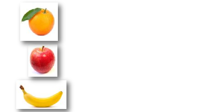{fig-align="center" width="50%"} <!--[cite: 3] -->

## Objetivo da Classificação Visual

Encontrar os hiperplanos, regras matemáticas ou funções discriminantes capazes de separar e isolar os objetos no espaço n-dimensional. <!--[cite: 3] -->

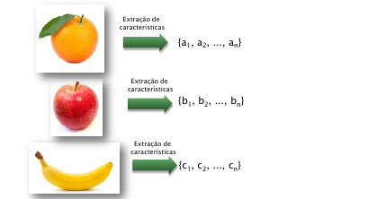{fig-align="center" width="50%"} <!--[cite: 3] -->

## Objetivo da Classificação Visual

Encontrar os hiperplanos, regras matemáticas ou funções discriminantes capazes de separar e isolar os objetos no espaço n-dimensional. <!--[cite: 3] -->

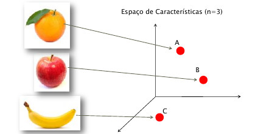{fig-align="center" width="50%"} <!--[cite: 3] -->

## Objetivo da Classificação Visual

Encontrar os hiperplanos, regras matemáticas ou funções discriminantes capazes de separar e isolar os objetos no espaço n-dimensional. <!--[cite: 3] -->

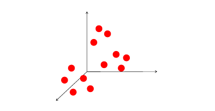{fig-align="center" width="50%"} <!--[cite: 3] -->

## Objetivo da Classificação Visual

Encontrar os hiperplanos, regras matemáticas ou funções discriminantes capazes de separar e isolar os objetos no espaço n-dimensional. <!--[cite: 3] -->

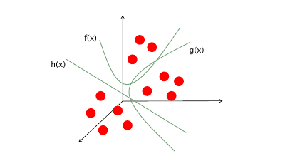{fig-align="center" width="50%"} <!--[cite: 3] -->

## Atributos e Discriminabilidade

A separabilidade das classes depende fortemente de quais características usamos (Feature Engineering). <!--[cite: 3] -->

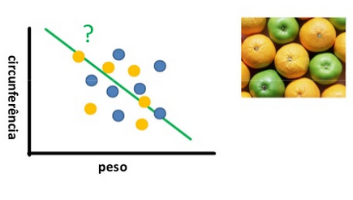{fig-align="center" width="80%"} <!--[cite: 3] -->

## Atributos e Discriminabilidade

Um mapeamento inadequado torna a classificação matematicamente intratável sem modelos não-lineares severos. <!--[cite: 3] -->

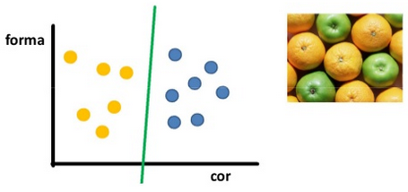{fig-align="center" width="80%"} <!--[cite: 3] -->

# Aprendizagem Supervisionada

## Classificação

**Definição:** Associar objetos a uma categoria ou classe com base em suas características.

. . .

**Exemplos:**

* Diagnóstico de pacientes com base em sintomas e exames.
* Classificação de clientes por risco de inadimplência.
* Organização automática de documentos por categorias.
* Identificação de spam em e-mails.

. . .

Os algoritmos de classificação aprendem a classificar melhor com o tempo à medida que novos exemplos/objetos são observados.

## O Fluxo Supervisionado

::: {.incremental}
- O algoritmo é alimentado com entradas $\mathbf{x}$ e seus rótulos corretos $y$ conhecidos (*Ground Truth*). <!--[cite: 3] -->
- O modelo procura uma função heurística onde $h(\mathbf{x}) \approx f(\mathbf{x})$. <!--[cite: 3] -->
- O objetivo primário é a **generalização**: o modelo deve conseguir prever as classes para dados completamente novos e nunca vistos. <!--[cite: 3] -->
- **Aplicações:** Classificação do grau de risco financeiro, categorização automática de PDFs técnicos, ou detecção acústica de falhas. <!--[cite: 3] -->
:::

## Componentes Analíticos

- **Instância / Objeto:** É a tupla completa contendo o perfil de atributos mais a sua respectiva classe. <!--[cite: 3] -->
- **Descritores (Features):** As variáveis independentes alimentadas no modelo. <!--[cite: 3] -->
- **Classe / Alvo (Target):** A variável dependente (resultado a ser previsto). <!--[cite: 3] -->

. . .

**Classificação e Natureza dos Atributos:** <!--[cite: 3] -->

- **Numéricos vs. Categóricos:** Peso (kg) vs. Gravidade da Falha. <!--[cite: 3] -->
- **Contínuos vs. Discretos:** Corrente do Motor (Amperes) vs. Quantidade de Defeitos. <!--[cite: 3] -->
- **Ordinais vs. Nominais:** Estatura (P, M, G) vs. Fabricante (Siemens, WEG). <!--[cite: 3] -->

## Desafios Comuns em Dados de Treinamento

::: {.incremental}
- **Desbalanceamento Estrutural:** Uma classe sobrepõe amplamente a outra. Na indústria, temos meses de "operação normal" contra 3 horas de "falha". O modelo tenderá a favorecer a maioria estatística se não corrigido. <!--[cite: 3] -->
- **Qualidade das Features:** O impacto de features irrelevantes (aumentam a confusão) ou features redundantes (multiplicam o peso de um mesmo fenômeno indevidamente, gerando colinearidade). <!--[cite: 3] -->
- **Ruído Aleatório Intrinseco:** Flutuações térmicas, erros de transcrição humana ou limitações físicas no *hardware* do sensor. <!--[cite: 3] -->
:::

## Principais Indutores: K-Nearest Neighbors (KNN)

Um algoritmo preguiçoso (*lazy learning*) baseado puramente em métricas espaciais (distância). <!--[cite: 3] -->

**Vantagens:** <!--[cite: 3] -->

- Facílimo de compreender, auditar e codificar matematicamente. <!--[cite: 3] -->
- Não compila um modelo explícito genérico; as instâncias históricas *são* o próprio modelo de consulta. <!--[cite: 3] -->

**Desvantagens:** <!--[cite: 3] -->

- Complexidade de inferência e custo computacional altíssimos para bases contendo milhões de linhas (Big Data). <!--[cite: 3] -->
- Demanda **obrigatoriamente** que todas as características sejam normalizadas ou reescaladas antes do uso. <!--[cite: 3] -->

## KNN: O Impacto da Escala

Se o *Atributo 1* está na casa das centenas, a distância Euclidiana será dominada por ele.

:::: {.columns}

::: {.column width="50%"}

**Base Bruta Original (Sem Normalização)**

| Atributo 1 | Atributo 2 | Classe |
|:----------:|:----------:|:------:|
| 170 | 68 | A |
| 180 | 75 | B |
| 160 | 50 | A |
| 150 | 45 | A |

:::

::: {.column width="50%"}

**Base Processada (Após Normalização Numérica)**

| Atributo 1 | Atributo 2 | Classe |
|:----------:|:----------:|:------:|
| 0.8 | 0.9 | A |
| 1.0 | 1.0 | B |
| 0.6 | 0.7 | A |
| 0.5 | 0.6 | A |

:::

::::

## Principais Indutores: Árvores de Decisão

Segmentam iterativamente o espaço baseado no ganho de informação (Entropia ou Gini).

:::: {.columns}

::: {.column width="50%"}

**Vantagens**

- Mapeamento transparente e altamente interpretável visualmente (regras explícitas IF-THEN).
- Lida naturalmente com atributos categóricos e numéricos contínuos simultaneamente.

:::

::: {.column width="50%"}

**Desvantagens**

- Tendência ao **Overfitting**, especialmente em árvores profundas.
- Alta sensibilidade aos dados: pequenas alterações na base de treinamento podem resultar em árvores significativamente diferentes.

:::

::::

## Exemplo de Construção de Árvore

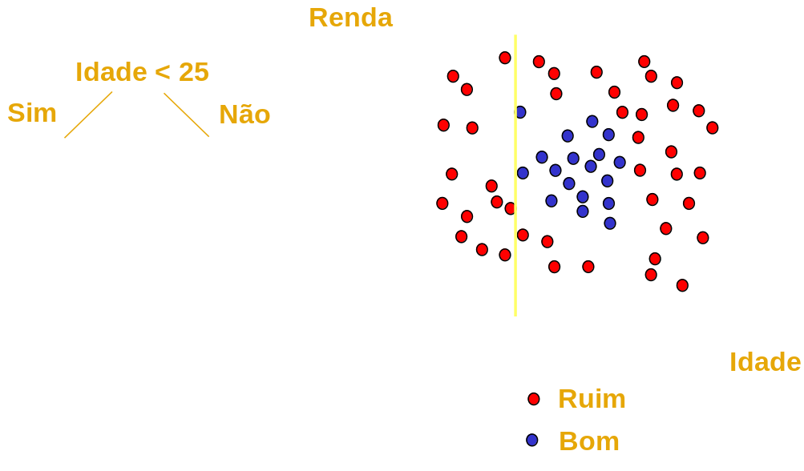{fig-align="center" width="100%"} <!--[cite: 3] -->

## Exemplo de Construção de Árvore

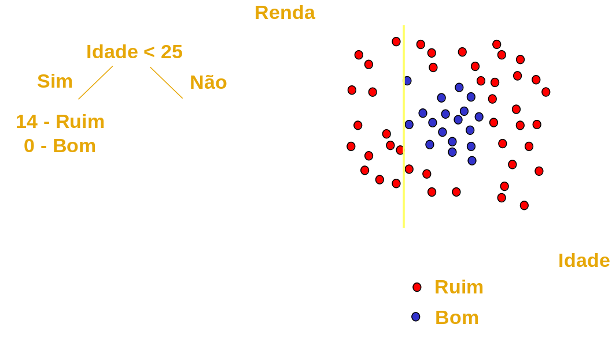{fig-align="center" width="100%"} <!--[cite: 3] -->

## Exemplo de Construção de Árvore

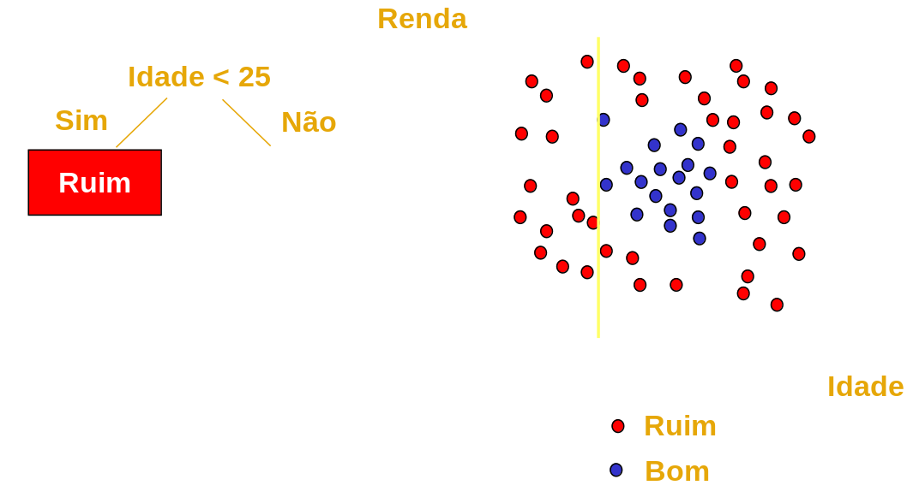{fig-align="center" width="100%"} <!--[cite: 3] -->

## Exemplo de Construção de Árvore

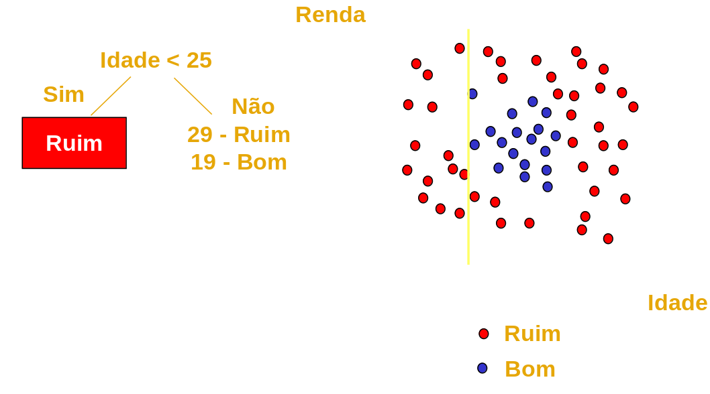{fig-align="center" width="100%"} <!--[cite: 3] -->

## Exemplo de Construção de Árvore

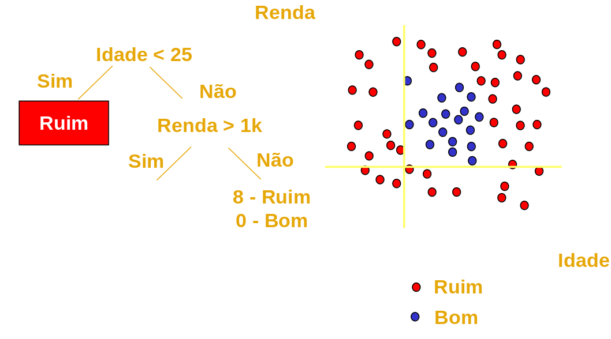{fig-align="center" width="100%"} <!--[cite: 3] -->

## Exemplo de Construção de Árvore

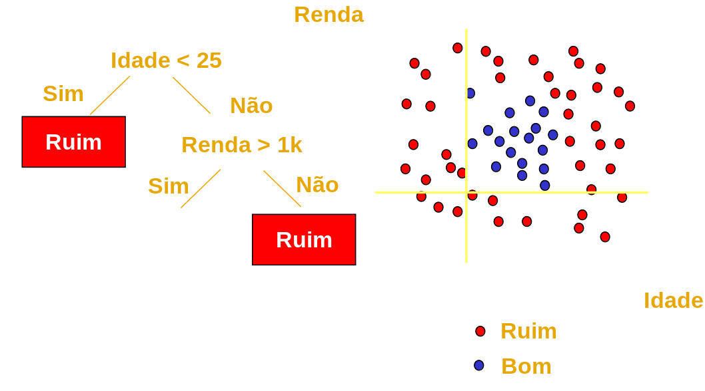{fig-align="center" width="100%"} <!--[cite: 3] -->

## Exemplo de Construção de Árvore

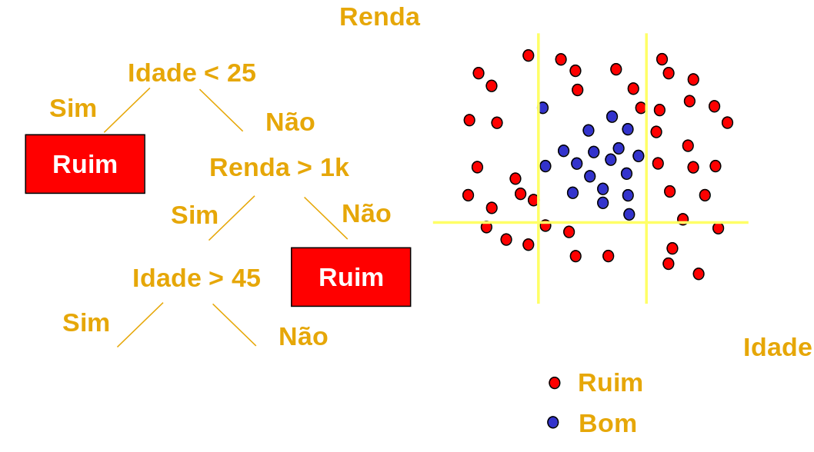{fig-align="center" width="100%"} <!--[cite: 3] -->

## Exemplo de Construção de Árvore

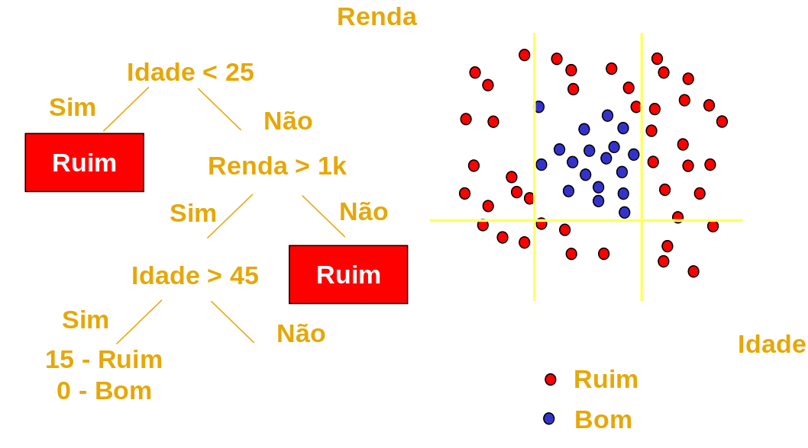{fig-align="center" width="100%"} <!--[cite: 3] -->

## Exemplo de Construção de Árvore

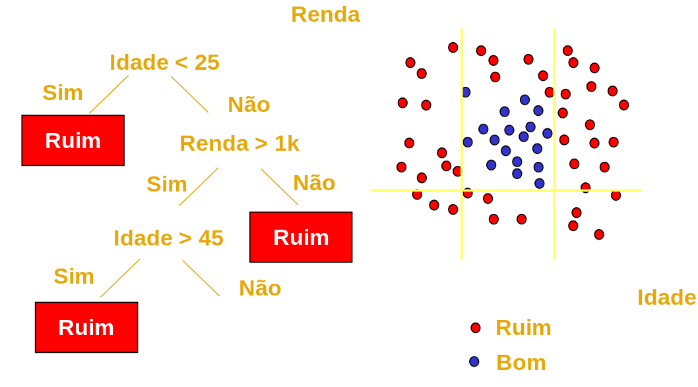{fig-align="center" width="100%"} <!--[cite: 3] -->

## Exemplo de Construção de Árvore

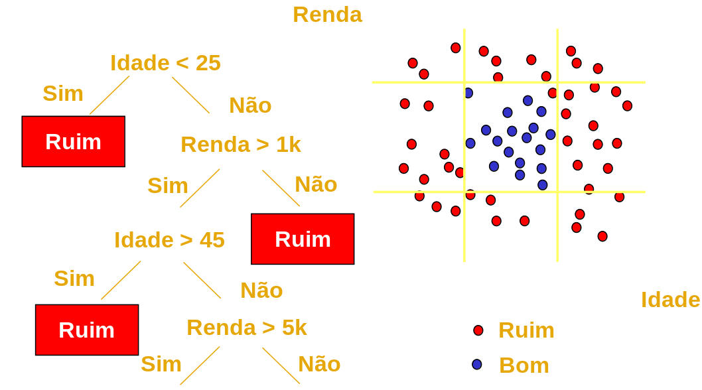{fig-align="center" width="90%"} <!--[cite: 3] -->

## Exemplo de Construção de Árvore

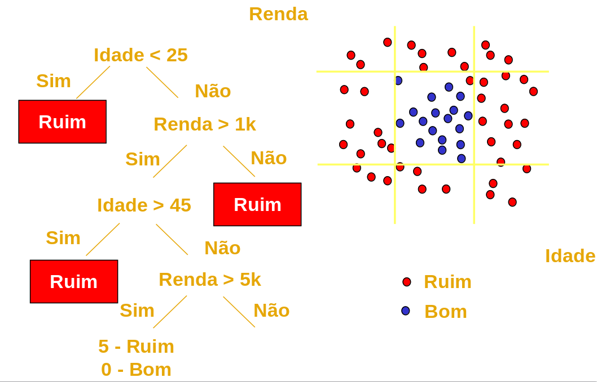{fig-align="center" width="80%"} <!--[cite: 3] -->

## Exemplo de Construção de Árvore

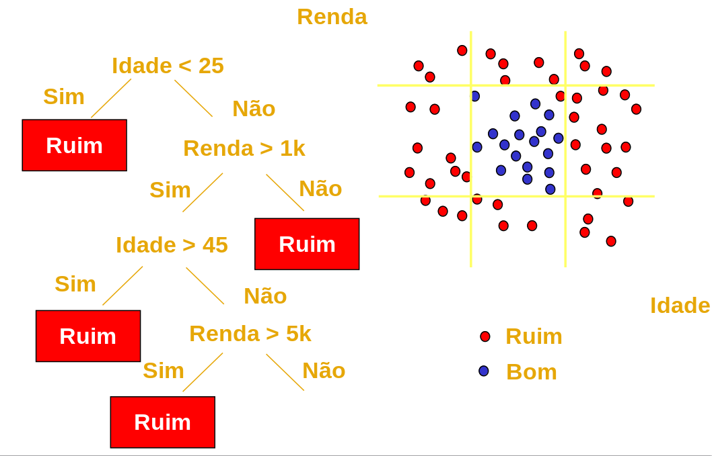{fig-align="center" width="80%"} <!--[cite: 3] -->

## Exemplo de Construção de Árvore

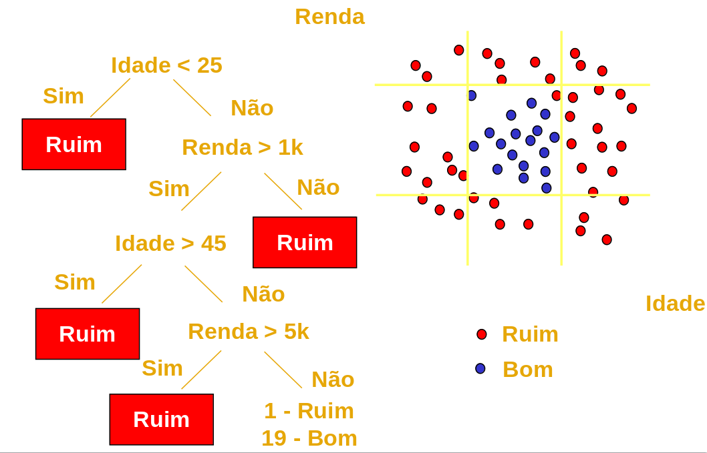{fig-align="center" width="70%"} <!--[cite: 3] -->

## Exemplo de Construção de Árvore

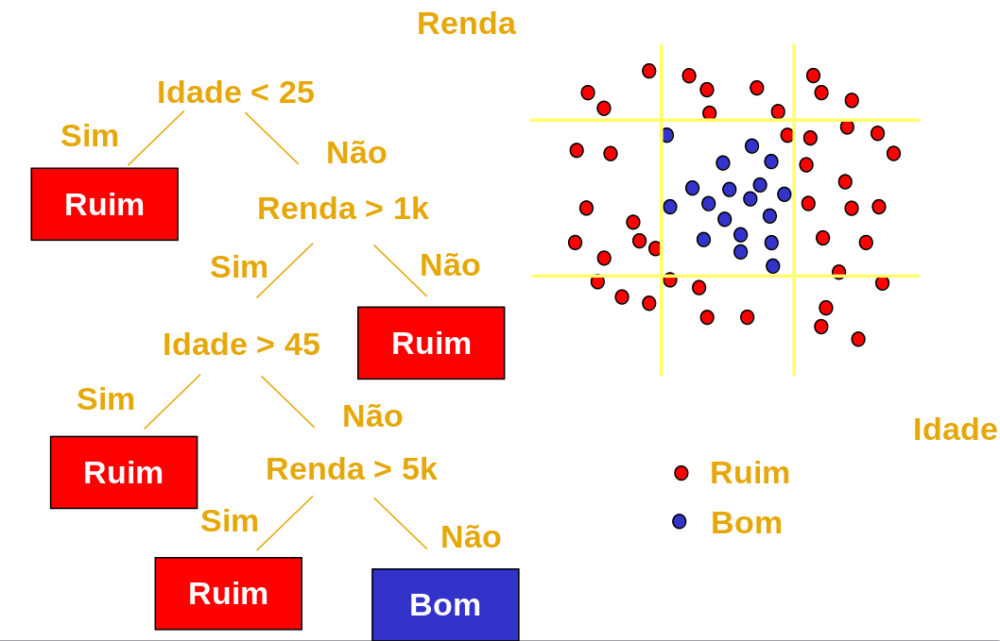{fig-align="center" width="70%"} <!--[cite: 3] -->

## Ensembles: Random Forest

Método baseado no treinamento paralelo de dezenas ou centenas de Árvores de Decisão (*bagging*).

:::: {.columns}

::: {.column width="50%"}

**Vantagens**

- Reduz significativamente o **overfitting** das árvores individuais por meio da diversidade das amostras.
- Alta robustez e excelente desempenho preditivo, especialmente em dados tabulares.

:::

::: {.column width="50%"}

**Desvantagens**

- Maior custo computacional de treinamento em comparação com uma única árvore.
- O desempenho pode ser afetado por atributos altamente correlacionados sem tratamento adequado.

:::

::::

## Métodos de Boosting

O **Boosting** é uma técnica de *ensemble* que combina vários modelos fracos para formar um modelo mais preciso. Cada novo modelo é treinado para corrigir os erros cometidos pelos modelos anteriores, melhorando o desempenho de forma incremental.  
**Principais algoritmos**

- **AdaBoost:** aumenta o peso das amostras classificadas incorretamente.
- **Gradient Boosting:** otimiza o modelo reduzindo iterativamente o erro.
- **XGBoost:** versão otimizada do Gradient Boosting, com alta eficiência e desempenho.
- **CatBoost:** otimizado para trabalhar com atributos categóricos, exigindo pouco pré-processamento.
- **LightGBM:** projetado para treinamento rápido e escalabilidade em *big data*.

## Ensembles: AdaBoost

Treina uma sequência de modelos fracos, onde cada novo modelo dá **maior atenção às amostras classificadas incorretamente** pelos modelos anteriores.

:::: {.columns}

::: {.column width="50%"}

**Vantagens**

- Simples de implementar e compreender.
- Reduz o erro ao focar progressivamente nos exemplos mais difíceis.
- Pode alcançar alta precisão quando os dados possuem pouco ruído.
- Funciona bem com modelos fracos, como árvores de decisão rasas (*stumps*).

:::

::: {.column width="50%"}

**Desvantagens**

- Sensível a **ruídos** e **outliers**, pois tende a aumentar o peso dessas amostras.
- O treinamento é sequencial, dificultando a paralelização.
- Pode apresentar queda de desempenho em bases muito complexas ou desbalanceadas.
- Requer ajuste adequado do número de modelos e da taxa de aprendizado.

:::

::::

## Ensembles: AdaBoost

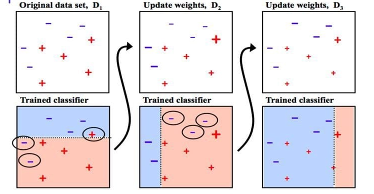{fig-align="center" width="100%"} <!--[cite: 3] -->

## Ensembles: Gradient Boosting {.smaller}

Constrói uma sequência de modelos fracos, onde cada novo modelo é treinado para corrigir os erros residuais do conjunto de modelos já criado.

:::: {.columns}

::: {.column width="50%"}

**Vantagens**

- Geralmente apresenta alta precisão em tarefas de classificação e regressão.
- Modela relações complexas entre os atributos.
- Flexível, permitindo diferentes funções de perda conforme o problema.
- Base para algoritmos modernos, como **XGBoost**, **LightGBM** e **CatBoost**.

:::

::: {.column width="50%"}

**Desvantagens**

- Treinamento mais lento devido à construção sequencial dos modelos.
- Requer ajuste cuidadoso de hiperparâmetros (número de árvores, profundidade e taxa de aprendizado).
- Pode sofrer **overfitting** se os parâmetros não forem bem configurados.
- Consome mais recursos computacionais do que métodos mais simples.

:::

::::

## Ensembles: Gradient Boosting

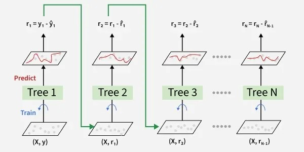{fig-align="center" width="100%"} <!--[cite: 3] -->

## Support Vector Machines (SVM) {.smaller}

Encontra um hiperplano que separa as classes com a maior margem possível, utilizando os vetores de suporte (amostras mais próximas da fronteira).

:::: {.columns}

::: {.column width="50%"}

**Vantagens**

- Excelente desempenho em problemas de alta dimensionalidade.
- Eficaz quando há poucas amostras e muitos atributos.
- O **Kernel Trick** permite resolver problemas com separação não linear convertendo as características num domínio hiperdimensional alternativo.
- Boa capacidade de generalização quando bem configurado.

:::

::: {.column width="50%"}

**Desvantagens**

- Escolher o **kernel** e seus parâmetros pode ser desafiador.
- Treinamento lento em bases de dados muito grandes.
- Menor interpretabilidade em comparação com árvores de decisão.
- Sensível à escolha dos hiperparâmetros.

:::

::::

## Representação Gráfica do SVM

Separação de classes maximizando a margem (largura entre os vetores de suporte). <!--[cite: 3] -->

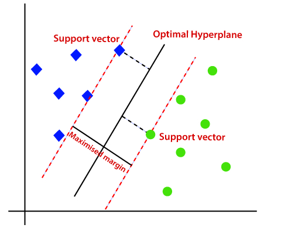{fig-align="center" width="50%"} <!--[cite: 3] -->

# Aprendizagem Não Supervisionada

## Clustering em Ação

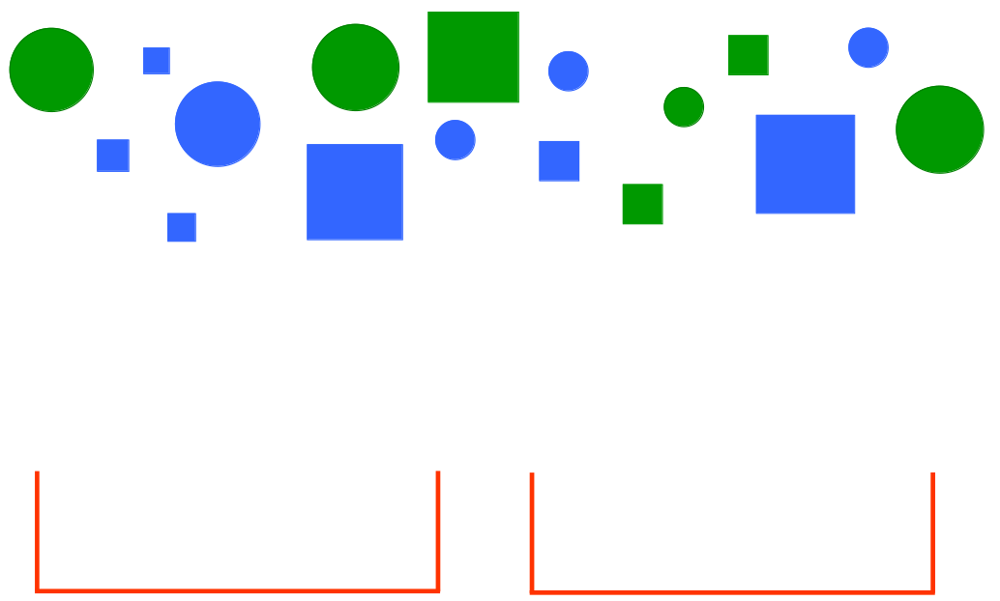{width="80%" style="display:block; margin:auto;"} <!--[cite: 3] -->

## Clustering em Ação

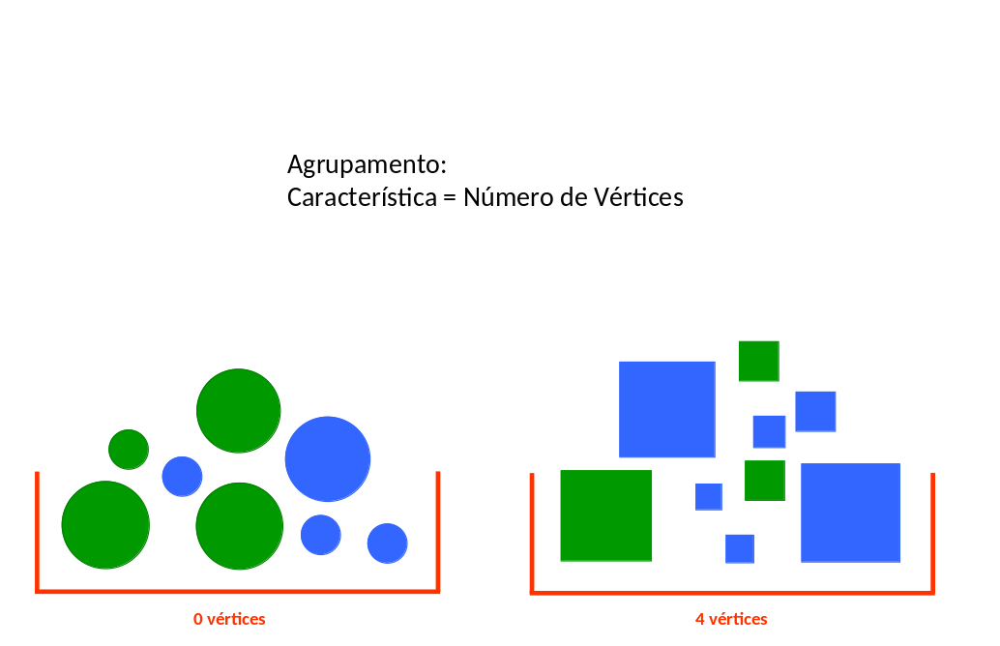{width="80%" style="display:block; margin:auto;"} <!--[cite: 3] -->

## Clustering em Ação

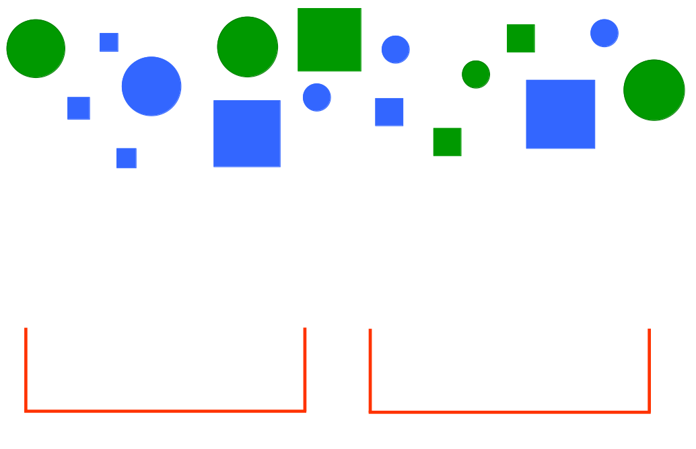{width="80%" style="display:block; margin:auto;"} <!--[cite: 3] -->

## Clustering em Ação

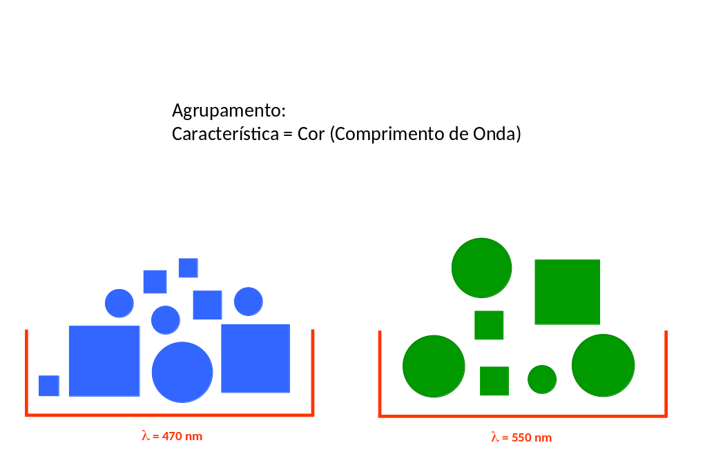{width="80%" style="display:block; margin:auto;"} <!--[cite: 3] -->

## Clustering em Ação

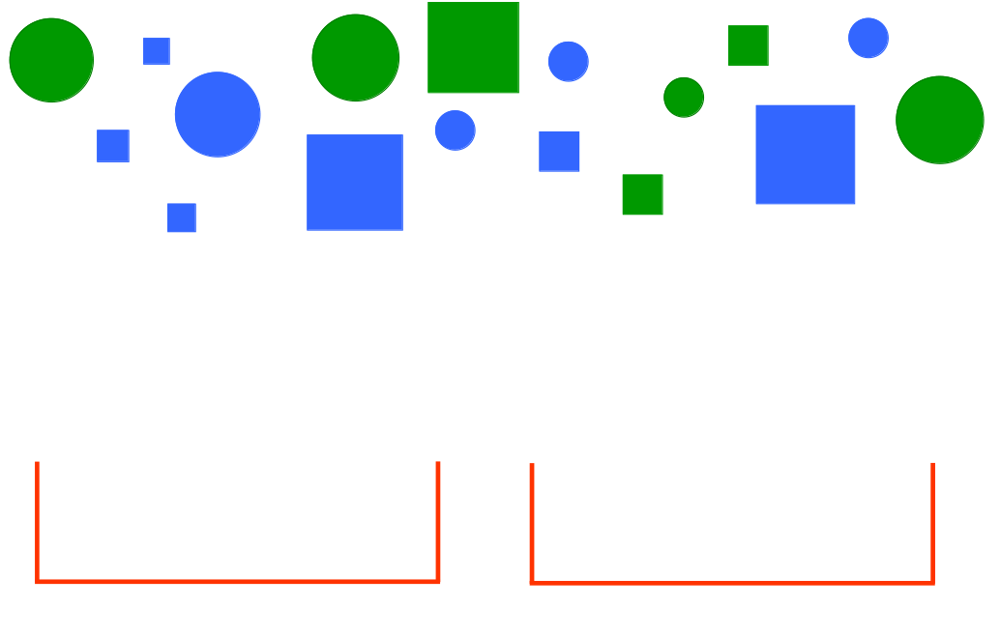{width="80%" style="display:block; margin:auto;"} <!--[cite: 3] -->

## Clustering em Ação

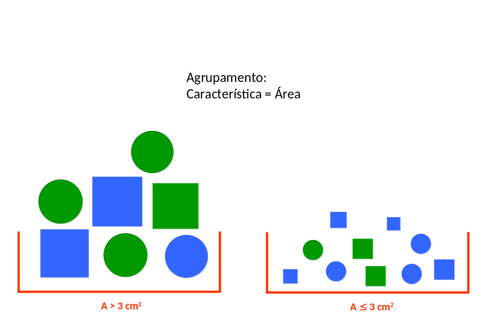{width="80%" style="display:block; margin:auto;"} <!--[cite: 3] -->

## Clustering em Ação

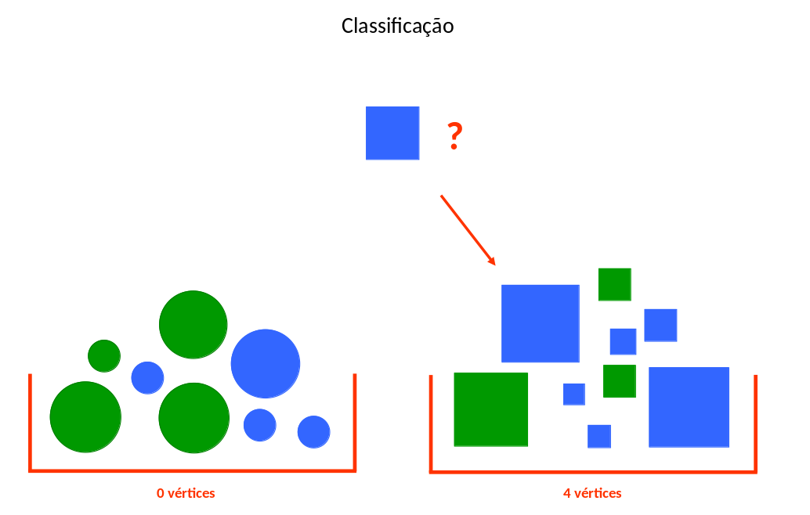{width="80%" style="display:block; margin:auto;"} <!--[cite: 3] -->

## Clustering em Ação

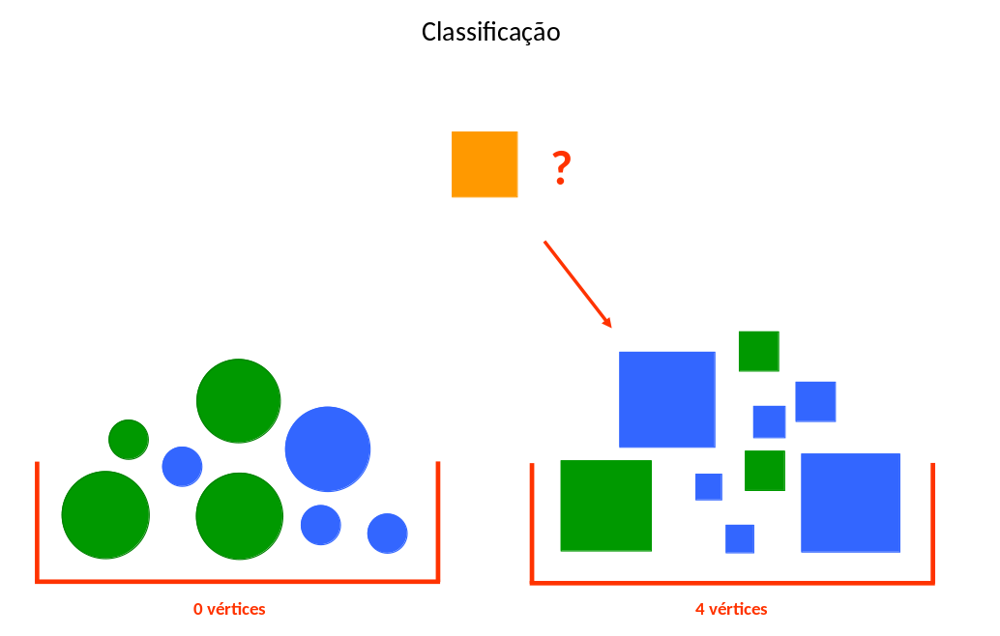{width="80%" style="display:block; margin:auto;"} <!--[cite: 3] -->

## Clustering em Ação

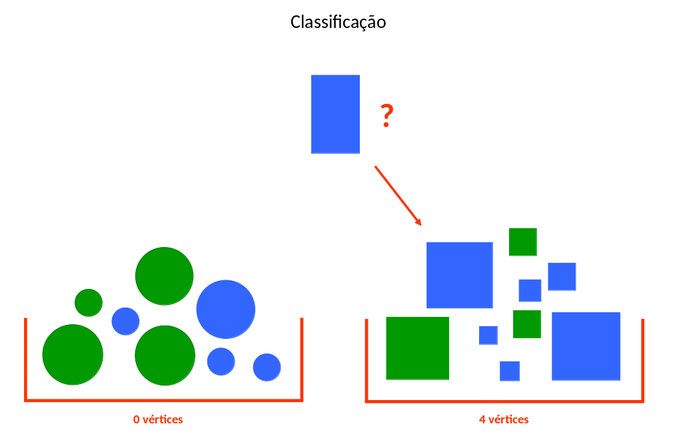{width="80%" style="display:block; margin:auto;"} <!--[cite: 3] -->

## Clustering em Ação

{width="80%" style="display:block; margin:auto;"} <!--[cite: 3] -->

## Clustering em Ação

{width="80%" style="display:block; margin:auto;"} <!--[cite: 3] -->

## Clustering em Ação

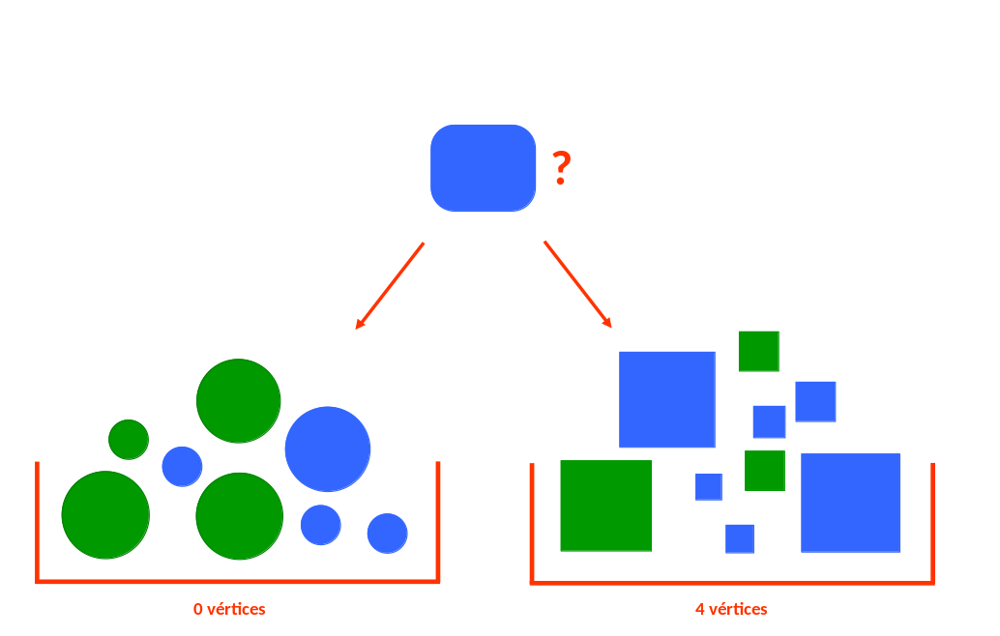{width="80%" style="display:block; margin:auto;"} <!--[cite: 3] -->

## Clustering em Ação

{width="80%" style="display:block; margin:auto;"} <!--[cite: 3] -->

## Clustering em Ação

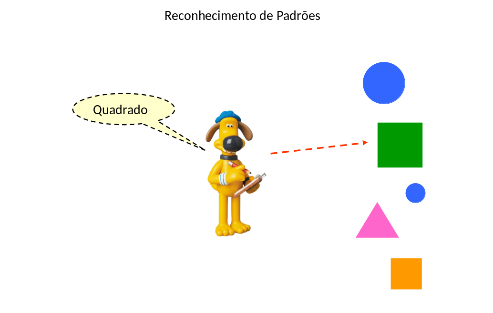{width="80%" style="display:block; margin:auto;"} <!--[cite: 3] -->

::: {.footer}
Fonte: www.ele.ita.br/~takashi/EE214_Clustering.ppt
:::

## Classificação vs. Clusterização

**Na Classificação (Supervisionada):** <!--[cite: 3] -->

- A resposta empírica e as fronteiras de categorias são preestabelecidas. <!--[cite: 3] -->
- Exemplo: O engenheiro ensina ao modelo os sintomas prévios que resultaram na parada mecânica histórica. <!--[cite: 3] -->

. . .

**Na Clusterização (Não Supervisionada):** <!--[cite: 3] -->

- As fronteiras não são impostas ou predefinidas pela interferência humana no banco de dados base. <!--[cite: 3] -->
- Grupos são formados espontaneamente iterando sobre matrizes baseadas em limiares topológicos e critérios métricos estritos de afinidade (similaridade). <!--[cite: 3] -->

## Topologia dos Agrupamentos

Os algoritmos particionam instâncias isoladas otimizando dois critérios simultâneos e fundamentais: <!--[cite: 3] -->

1. **Alta Similaridade Intra-cluster:** Os vetores contidos num mesmo núcleo agrupado precisam estar geometricamente próximos e ser intrinsecamente homogêneos. <!--[cite: 3] -->
2. **Baixa Similaridade Inter-cluster:** Os núcleos estabelecidos independentemente devem preservar fronteiras claras (caráter heterogêneo) distanciando os grupos divergentes. <!--[cite: 3] -->

. . .

**Objetivo:**

* Maximizar a similaridade dentro de cada cluster
* Minimizar a similaridade entre clusters diferentes

## Principais Etapas da Clusterização

1. **Aquisição dos dados**
   - Seleção de amostras e características

2. **Pré-processamento dos dados**
   - Normalização e mudança de escala
   - Extração de características

3. **Construção da Matriz de Dados**

4. **Cálculo da Similaridade**
   - Escolha de uma medida de similaridade
   - Construção da Matriz de Similaridades

5. **Seleção de Algoritmo de Cluster**

6. **Análise e Interpretação dos Resultados**

## Abordagens Analíticas de Agrupamento

::: {.incremental}
- **Estruturação Algorítmica (Particionais vs. Hierárquicos):** <!--[cite: 3] -->
  - Particionais processam os dados isolando fronteiras em aglomerados desvinculados estruturalmente na matriz dimensional e disjuntos por definição (ex: *K-Means* clássico). <!--[cite: 3] -->
  - Hierárquicos derivam um ecossistema complexo (dendrograma) conectando subclusters progressivamente estruturados de forma aninhada. <!--[cite: 3] -->
- **Matriz de Pertinência:** <!--[cite: 3] -->
  - Exclusivos: Determinam vetorialmente o pertencimento único e fechado a um agrupamento. <!--[cite: 3] -->
  - Não exclusivos (*Fuzzy* ou probabilísticos): Um equipamento pode pertencer a classes diferentes com flutuações de probabilidade ($0.7$ no Cluster A, $0.3$ no Cluster B). <!--[cite: 3] -->
:::

## Medidas de Similaridade e Correlação

Para o sistema agrupar as amostras corretamente, precisamos instruir como ele calcula a afinidade analítica entre elas: <!--[cite: 3] -->

::: {.incremental}
- **Medidas de Distância Pura (Geometria Direta):** Euclidiana e Manhattan, cujo princípio incide no fator numérico (proximidade métrica estrita do valor numérico nos eixos ortogonais do sistema hiperespacial contínuo). <!--[cite: 3] -->
- **Medidas Correlacionais Analíticas:** Coeficiente linear empírico de Pearson; ignora magnitudes e capta especificamente dinâmicas e tendências acopladas nos perfis dimensionais. <!--[cite: 3] -->
- **Medidas de Associação de Presença/Intersecção (Conjuntos):** Índice Jaccard. <!--[cite: 3] -->
:::

## Medidas de Similaridade e Correlação

**Comparação:**

* Medidas correlacionais não consideram a magnitude, apenas padrões
* Medidas de distância se concentram na proximidade de valores

## O que é uma boa clusterização?

- Um bom agrupamento fornece grupos de alta qualidade quando:
  - A similaridade **intra-cluster** é alta
  - A similaridade **inter-cluster** é baixa

- A qualidade depende de:
  - Medida de similaridade adotada
  - Algoritmo de cluster utilizado

# Regressão

## O Paradigma da Regressão

Na classificação nós inferimos uma *categoria* discreta. A regressão projeta um *valor contínuo* em uma variável contínua estendida. <!--[cite: 3] -->

O objetivo é modelar a relação entre uma variável dependente $(y)$ e uma ou mais variáveis independentes $(x_1 , x_2 , . . . , x_n )$.

A forma mais simples é a *regressão linear*: <!--[cite: 3] -->
$$ y = \beta_0 + \beta_1 x_1 + \epsilon $$ <!--[cite: 3] -->

*O modelo foca em otimizar $(\beta_0, \beta_1)$ visando reduzir a margem residual ($\epsilon$), isto é, a diferença entre os valores previstos e reais.* <!--[cite: 3] -->

## Tipos de Regressão

- **Regressão Linear**
  - Modela uma relação aproximadamente linear entre as variáveis de entrada e a variável resposta.

- **Regressão Polinomial**
  - Permite modelar relações não lineares por meio de termos polinomiais, mantendo a estrutura de uma regressão linear.

- **Regressão Logística**
  - Utilizada para problemas de classificação, estimando a probabilidade de uma observação pertencer a uma classe.

- **Regressão Ridge e Lasso**
  - Introduzem regularização para reduzir o sobreajuste (*overfitting*) e melhorar a capacidade de generalização do modelo.

## Aspectos Positivos da Regressão

::: {.incremental}
- **Simplicidade e Interpretabilidade**
  - Fácil de compreender, implementar e interpretar, especialmente na regressão linear. Os coeficientes do modelo mostram como cada variável influencia a variável resposta.

- **Eficiência computacional**
  - Treinamento rápido e baixo custo computacional, mesmo em conjuntos de dados grandes.

- **Predição de valores contínuos**
  - Adequada para estimar variáveis numéricas contínuas.

- **Flexibilidade**
  - Pode incorporar transformações, interações entre variáveis e técnicas de regularização (Ridge e Lasso).
:::

## Limitações da Regressão

::: {.incremental}

- **Sensibilidade a outliers e Dependência da Qualidade dos Dados**
  - Valores extremos podem influenciar significativamente os coeficientes do modelo. Ruído e erros de medição podem comprometer o desempenho e a confiabilidade do modelo.

- **Hipótese de linearidade**
  - A regressão linear pressupõe uma relação aproximadamente linear entre as variáveis, o que nem sempre ocorre na prática.

- **Risco de overfitting**
  - Modelos muito complexos, como regressões polinomiais de alto grau, podem se ajustar excessivamente aos dados de treinamento.

- **Multicolinearidade**
  - Alta correlação entre variáveis explicativas dificulta a estimação dos coeficientes e reduz sua interpretabilidade.
:::

# Engenharia e Seleção de Características (*Feature Selection*)

## Seleção de Características

Muitos algoritmos de classificação são projetados para selecionar as características mais relevantes para a tomada de decisão.

- Algoritmos de indução de árvores de decisão, por exemplo, são projetados para escolher o atributo mais promissor para particionar o conjunto de dados.
- O objetivo é nunca selecionar atributos irrelevantes.

> A questão é: **Mais atributos implicam em maior poder discriminatório?**

## Impacto de Características Irrelevantes

A inclusão de características pouco significativas em relação à classe alvo geralmente "confunde" o algoritmo de classificação/aprendizado.

- A presença de atributos irrelevantes pode diminuir a precisão do modelo, pois esses atributos podem criar "ruído" no processo de decisão.
- Muitos atributos podem resultar em overfitting, onde o modelo se ajusta demais aos dados de treinamento, perdendo capacidade de generalização.

## Algoritmos Mais Afetados

A seleção inadequada de características pode afetar mais alguns tipos de algoritmos:

- **Indutores de Árvores de Decisão:** A quantidade de dados é reduzida continuamente a cada escolha/divisão, o que pode gerar complexidade excessiva.
- **Indutores baseados em instâncias (e.g., k-NN):** Esses algoritmos sempre trabalham com vizinhanças locais e levam em consideração apenas algumas poucas instâncias ($k$).

É conhecido que, para se alcançar um bom nível de desempenho, a quantidade de amostras necessárias cresce exponencialmente.

## Benefícios da Seleção de Características

- **Melhora o desempenho preditivo:** A remoção de atributos irrelevantes pode melhorar a capacidade do modelo de fazer previsões precisas.
- **Acelera o processo de aprendizado:** Com menos dados, o algoritmo pode aprender mais rapidamente.
- **Representação mais compacta:** A seleção foca nas características realmente importantes para a definição do conceito/classe a ser aprendido.

No entanto, o processo de seleção de características pode ser custoso em termos computacionais e, às vezes, seu custo pode superar o ganho em desempenho.

## Redução de Dimensionalidade

- O objetivo é criar uma representação reduzida das características, preservando ao máximo a informação presente nos dados.
- Em geral, a redução de dimensionalidade melhora o desempenho dos classificadores.
- O objetivo é eliminar atributos redundantes ou irrelevantes, simplificando a fase de aprendizado e classificação.

## Métodos de Seleção de Características

Existem diferentes abordagens para a seleção de características, que podem ser divididas em dois principais tipos:

- **Manual:** Melhor quando há um entendimento profundo tanto sobre o problema de aprendizado quanto sobre o significado das características.
- **Automático:**
  - *Filtros:* Método usado antes do processo de aprendizado para selecionar um subconjunto de características com base em critérios estatísticos ou heurísticos.
  - *Wrappers:* A escolha do subconjunto de características está integrada com o algoritmo de aprendizado/classificador, avaliando a qualidade do conjunto de características durante o treinamento.

## Métodos Automáticos

Remover redundância melhora a representação matemática reduzida, refinando as aproximações de aprendizado. As principais principais em Inteligência Artificial incluem duas visões matemáticas em métodos estatísticos: <!--[cite: 3] -->

- **Abordagem *Filtros*:** Opera pré-processando e selecionando características estatísticas avaliando individualmente as forças e variáveis (ex. critério Qui-quadrado e correlações estritas tipo Pearson) desvinculadas das especificidades do algoritmo. <!--[cite: 3] -->
- **Abordagem *Wrappers*:** Avalia os resultados integrados recursivamente de subconjuntos completos empiricamente combinados submetidos na arquitetura contínua de validação da indução, verificando de fato no modelo iterativamente. <!--[cite: 3] -->

## Algoritmos Wrappers - Busca para Frente (SFS) {.smaller}

A **Busca Sequencial para Frente (SFS)** é um algoritmo de seleção de características que segue os seguintes passos:

- Inicia com o subconjunto de características vazio.
- A melhor característica individual é selecionada de acordo com uma função critério.
- A segunda característica que, em conjunto com a primeira, formar a melhor dupla, é selecionada.
- Este processo continua de forma "gulosa", com a adição de características até que:
  - O tamanho máximo do subconjunto seja atingido, ou
  - A função critério pare de "melhorar" com a adição de novas características.

**Efeito "nesting":** A seleção de características pode ser influenciada por características já adicionadas.

## Algoritmos Wrappers - Busca Sequencial para Trás (SBS) {.smaller}

A **Busca Sequencial para Trás (SBS)** segue uma abordagem semelhante à Busca para Frente, mas com algumas diferenças:

- Inicia com o subconjunto contendo todas as características disponíveis.
- A cada passo, uma característica é removida com base na função critério adotada.
- É comum restringir a busca a subconjuntos menores de características, evitando a remoção de muitas características de uma vez.
- Pode-se adotar uma medida de melhoria a cada iteração para evitar que pequenas variações causem a remoção excessiva de características.

## Busca Flutuante para Frente (SFFS)

A **Busca Flutuante para Frente (SFFS)** combina as ideias da busca para frente com uma técnica de "flutuação" das características:

- A busca é iniciada com o subconjunto vazio, selecionando a melhor característica individualmente de acordo com uma função critério.
- Em seguida, a segunda característica que, em conjunto com a primeira, formar a melhor dupla, é escolhida.
- A partir da terceira característica, o algoritmo tenta fazer uma exclusão condicional para remover características que não contribuem significativamente para o desempenho.

**Evita o efeito "nesting":** Ao permitir a remoção de características durante o processo, evita-se a seleção de um conjunto subótimo.

## SBFS (Seleção Sequencial Flutuante para Trás)

A **Seleção Sequencial Flutuante para Trás (SBFS)** segue a lógica do SFFS, mas invertendo o processo:

- Inicia com todas as características e tenta remover as menos importantes de acordo com a função critério.
- Durante a busca, o algoritmo permite a reinclusão de características que possam melhorar o desempenho, garantindo que o processo não se prenda a um conjunto de características subótimo.

## Filtros vs Wrappers {.smaller}

**Filtros:**

- O processo de escolha do subconjunto de características ocorre antes do aprendizado.
- Não dependem diretamente do modelo de classificação utilizado.
- Exemplos: Testes estatísticos, correlação de Pearson, teste qui-quadrado.

**Wrappers:**

- A escolha do subconjunto de características está "empacotada" com o algoritmo de aprendizado.
- Dependem diretamente do modelo de classificação utilizado.
- Exemplos: Algoritmos como SFS, SBS, e métodos baseados em redes neurais.

**Diferença principal:** Filtros selecionam características antes do aprendizado, enquanto Wrappers envolvem o aprendizado no processo de seleção.

# Avaliação e Validação de Modelos

## Matriz de Confusão

A **Matriz de Confusão** tem como objetivo medir a similaridade entre as respostas do classificador e as classes conhecidas para as amostras. Cada elemento desta matriz indica o quão "confuso" foi o classificador ao tentar classificar corretamente cada amostra.

- Utilizada para estimar o erro de classificação ao sumarizar os resultados do classificador.
- O número de acertos é identificado na diagonal principal $M(C_i, C_i)$.
- Os elementos fora da diagonal $M(C_i, C_j)$, para $i \neq j$, representam os erros de classificação.
- Em um classificador ótimo, a diagonal principal possui valores positivos e todas as demais posições têm valores iguais a zero.

## Estrutura da Matriz

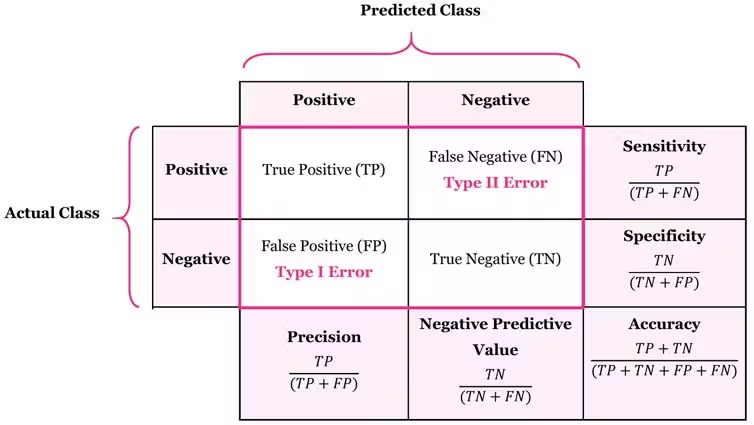{fig-align="center" width="100%"} <!--[cite: 3] -->

## Métodos de Validação {.smaller}

**Holdout:**

- O conjunto de dados é dividido em dois subconjuntos: \(2/3\) para treinamento e \(1/3\) para teste.

**Validação Cruzada (k-fold):**

- O conjunto de dados é dividido em \(k\) subconjuntos exclusivos e exaustivos.
- O algoritmo é executado \(k\) vezes, utilizando um subconjunto diferente para teste em cada execução.

**Bootstrap:**

- A amostragem é feita com reposição, permitindo que o mesmo exemplo apareça múltiplas vezes no conjunto de treinamento.

## Desbalanceamento entre Classes {.smaller}

Suponha um conjunto de amostras com a seguinte distribuição de classes:

- distribuição\((C1, C2, C3) = (99,00\%, 0,25\%, 0,75\%)\).

Um classificador simples que classifique sempre novos exemplos como pertencentes à classe majoritária \(C1\) teria uma acurácia de \(99,00\%\).

- Isto pode ser indesejável quando as classes minoritárias, como \(C2\) e \(C3\), contêm informações importantes.

::: {.fragment}

**Exemplo:**

- \(C1\): transação normal (500 transações)
- \(C2\): transação fraude (4 operações)

- Acurácia (amostras) = 90%
- Classificou corretamente 454 transações que não são fraude.
- Não acertou nenhuma das transações de fraude.

**Pode ser considerado um "bom classificador"?**

:::

## O Perigo do Desbalanceamento (Ilusão da Acurácia)

- Histórico de Vibração ($C1$ - Operação Normal): 500 aferições (transações). <!--[cite: 3] -->
- Histórico de Choque Anômalo ($C2$ - Falha / Fraude): 4 aferições (transações atípicas operacionais avaliáveis perigosas com alto risco na ponta). <!--[cite: 3] -->

Um classificador que prevê sempre a classe majoritária pode apresentar alta acurácia, mas falha completamente em identificar os casos críticos da classe minoritária. Em aplicações de manutenção preditiva, isso significa ignorar falhas importantes, tornando o modelo inadequado apesar da elevada acurácia. <!--[cite: 3] -->

## Medidas de Desempenho {.smaller}

A combinação de várias métricas é essencial para avaliar corretamente o desempenho de um classificador, especialmente em cenários com classes desbalanceadas. Algumas das principais métricas incluem:

- **Acurácia:** Percentual de classificações corretas.
- **Precisão:** Percentual de exemplos classificados como positivos que são realmente positivos.
- **Recall:** Percentual de exemplos positivos corretamente identificados.
- **MCC (Coeficiente de Correlação de Matthews):** Uma métrica que considera todas as quatro combinações possíveis de classes.
- **Sensibilidade:** Medida da capacidade do classificador de identificar casos positivos.
- **F1-Score:** A média harmônica entre precisão e recall.

::: {.fragment}

Cada uma dessas métricas tem seu uso dependendo do cenário, sendo que, em conjuntos desbalanceados, algumas delas podem ser mais informativas que outras.

:::

## Resumo das Métricas

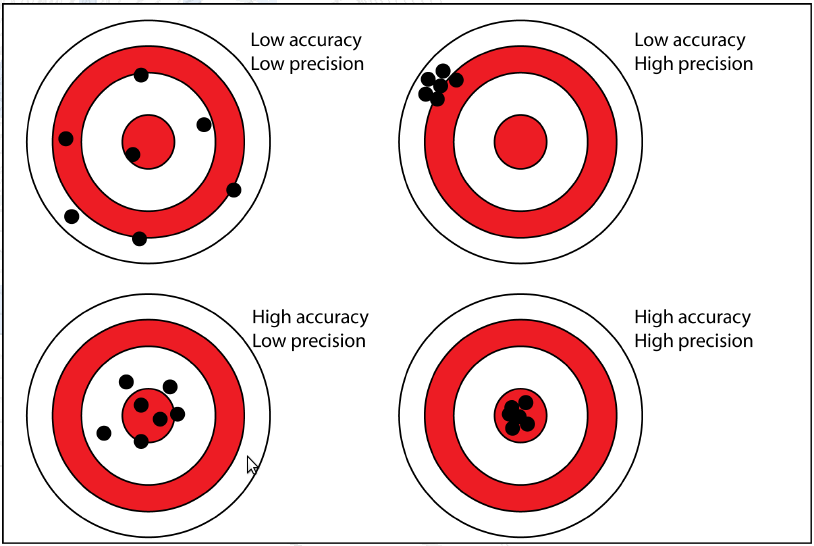{fig-align="center" width="80%"} <!--[cite: 3] -->

## Curva ROC

A **Curva ROC (Receiver Operating Characteristic)** é uma ferramenta gráfica utilizada para avaliar o desempenho de classificadores binários. Ela exibe a **taxa de falsos positivos (FPR)** no eixo X e a **taxa de verdadeiros positivos (TPR)** no eixo Y.

- A curva ROC permite visualizar a capacidade de discriminação do modelo em diferentes limiares de decisão.
- Quanto mais próxima da parte superior esquerda da área do gráfico, melhor o desempenho do modelo.

A **área sob a curva (AUC)** é frequentemente usada como uma métrica adicional para quantificar o desempenho do modelo.

---

## AUC (Área Sob a Curva)

A **AUC (Área Sob a Curva)** é uma métrica derivada da curva ROC. Ela quantifica a área total sob a curva ROC e varia de 0 a 1.

- **AUC = 1:** Classificador perfeito.
- **AUC = 0.5:** Classificador aleatório (sem poder discriminativo).
- **AUC < 0.5:** Classificador pior que o aleatório.

**A AUC é útil porque:**

- Avalia o modelo independentemente do limiar de decisão.
- Fornece uma medida da capacidade do modelo em distinguir entre as classes.

## Curva ROC e AUC na Prática

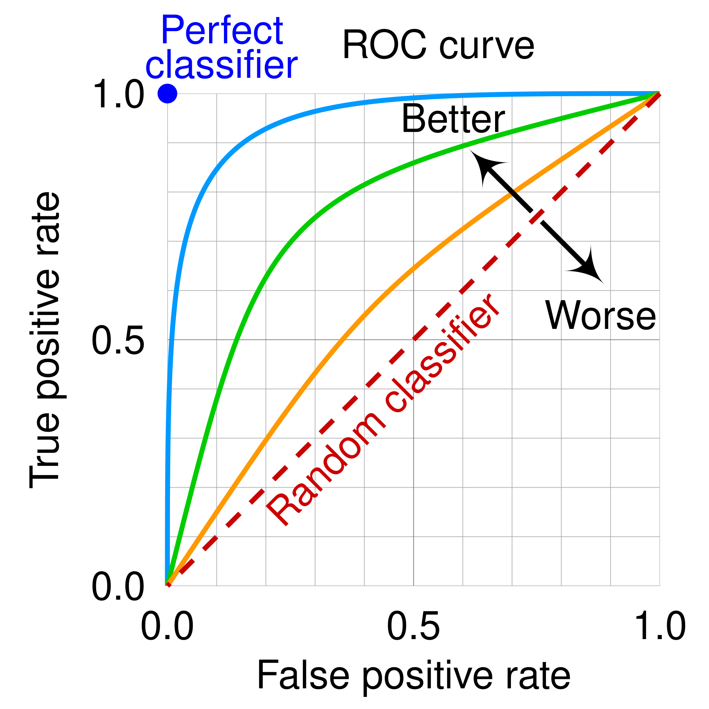{fig-align="center" width="55%"} <!--[cite: 3] -->

# Exemplos

# Dúvidas? {background-color="#f1c40f"}

::: {.center}
Matheus Pimenta

<omatheuspimenta@outlook.com>
:::