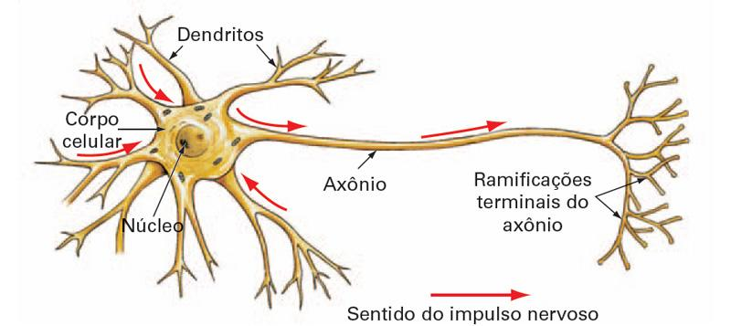
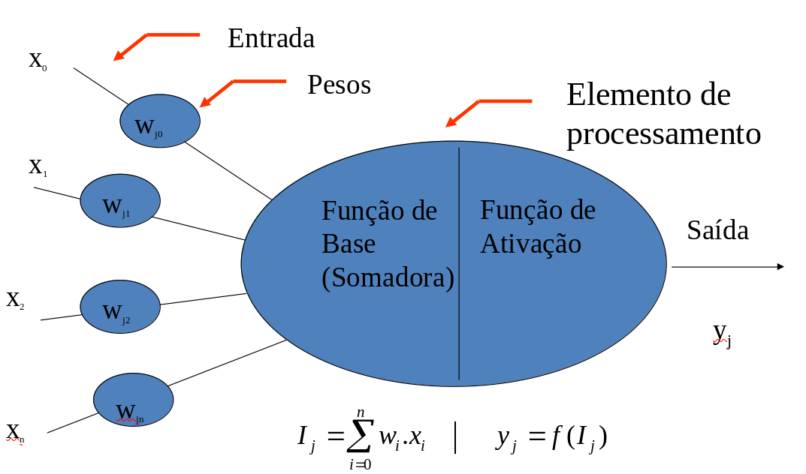
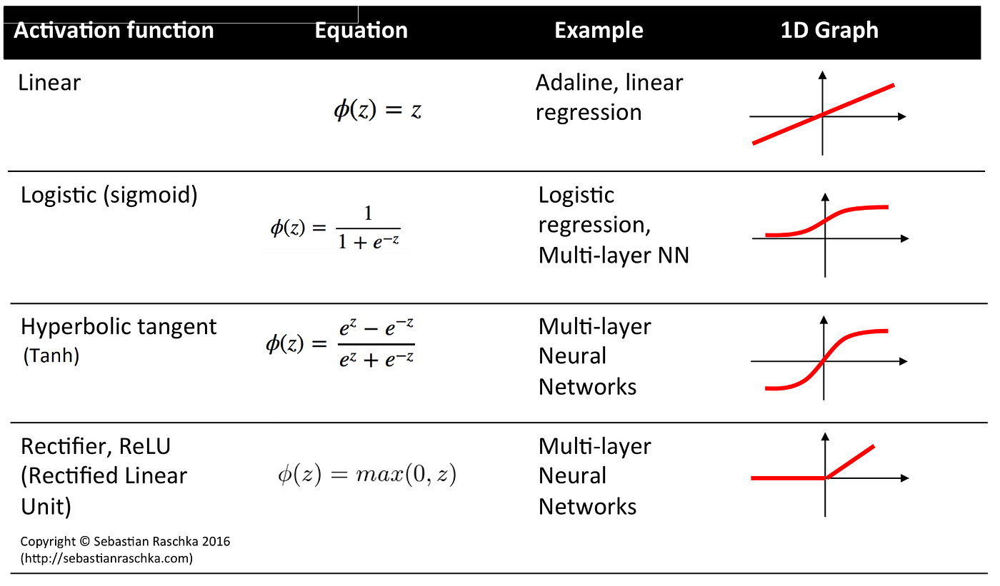
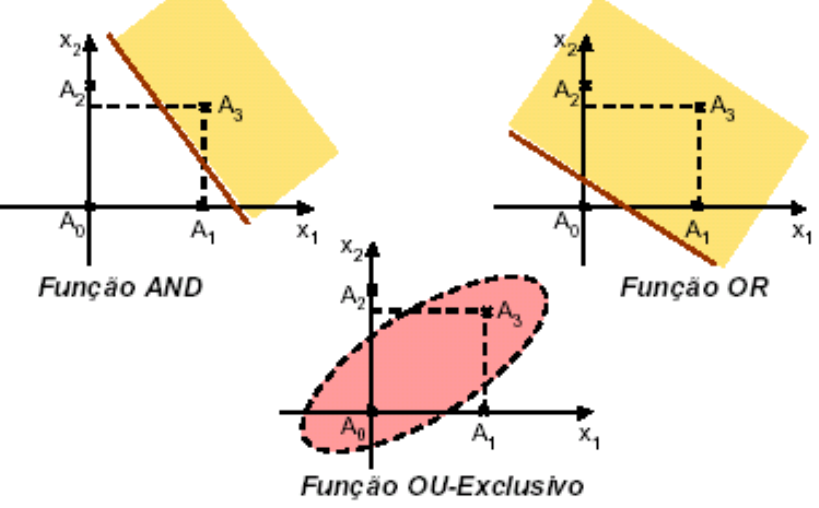
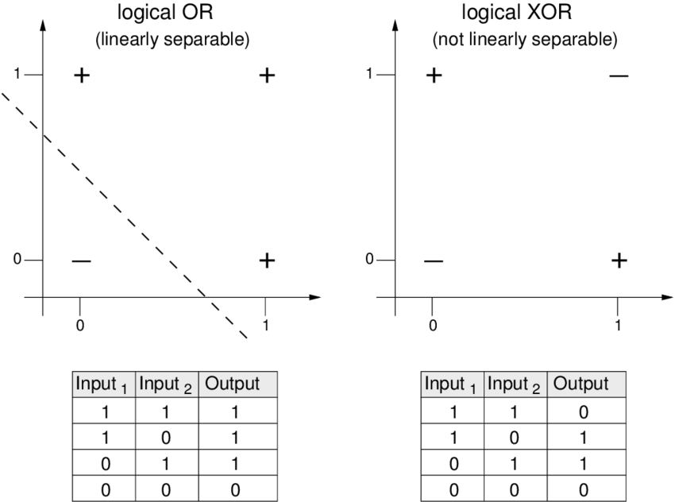
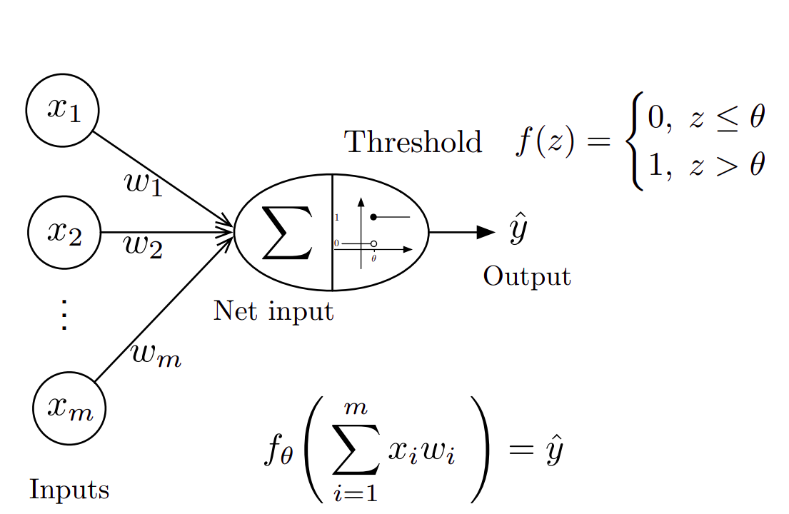
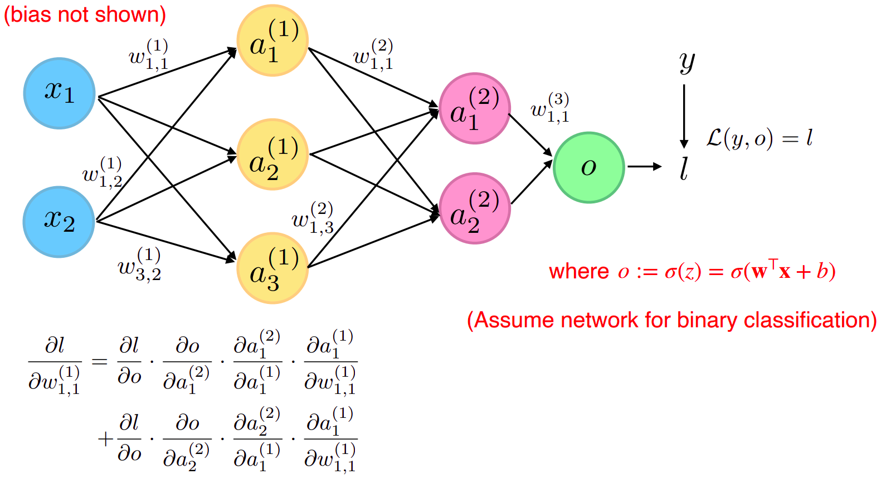
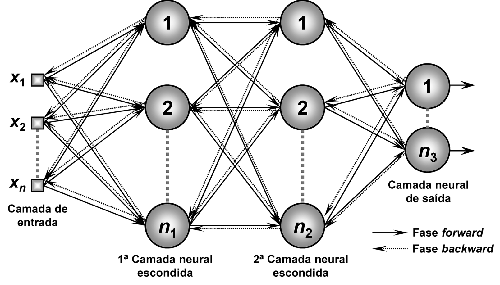

# Redes Neurais

## O que são Redes Neurais?

Redes Neurais são modelos inspirados no funcionamento do cérebro humano e do sistema nervoso. Algumas características incluem: <!--[cite: 4] -->

- Alto grau de paralelização no processamento da informação. <!--[cite: 4] -->
- Aprendizagem por meio de ajustes simples que resultam em comportamentos complexos. <!--[cite: 4] -->
- Aplicações como solucionadores de problemas e modelos biológicos. <!--[cite: 4] -->
- Processo de aquisição de conhecimento através de dados e algoritmos de aprendizado. <!--[cite: 4] -->

## Analogias com o Cérebro Humano

**O cérebro:** <!--[cite: 4] -->

- Estrutura altamente complexa, não linear e paralela. <!--[cite: 4] -->
- Capacidade de organizar seus neurônios para realizar tarefas complexas. <!--[cite: 4] -->
- Um neurônio é cerca de 5 a 6 vezes mais lento do que uma porta lógica. <!--[cite: 4] -->
- Supera essa lentidão com uma estrutura massivamente paralela. <!--[cite: 4] -->
- O córtex humano contém aproximadamente: <!--[cite: 4] -->
  - 10 bilhões de neurônios. <!--[cite: 4] -->
  - 60 trilhões de sinapses. <!--[cite: 4] -->

## Redes Neurais Artificiais

Redes Neurais Artificiais são modelos de aprendizado de máquina que buscam uma analogia com o funcionamento do cérebro humano: <!--[cite: 4] -->

- Processadores paralelos compostos por unidades simples (neurônios artificiais). <!--[cite: 4] -->
- O conhecimento é armazenado nas conexões entre os neurônios. <!--[cite: 4] -->
- O aprendizado é adquirido a partir do ambiente (dados) através de um processo de ajuste dos pesos das conexões. <!--[cite: 4] -->

## Neurônios Biológicos

O principal componente do sistema nervoso dos animais é uma célula denominada **neurônio**, que atua como um elemento de processamento. <!--[cite: 4] -->

- Cada neurônio recebe sinais de entrada através de sinapses. <!--[cite: 4] -->
- O processamento interno determina a transmissão de sinais para outros neurônios. <!--[cite: 4] -->
- Um neurônio biológico é capaz de interagir com milhares de outros neurônios. <!--[cite: 4] -->

## Neurônios Biológicos

{fig-align="center" width="100%"} <!--[cite: 4] -->

## Neurônios Artificiais

**O neurônio artificial** pode ser visto como uma unidade de processamento com: <!--[cite: 4] -->

- **Função de entrada:** Recebe um conjunto de dados ou conexões. <!--[cite: 4] -->
- **Pesos:** Cada conexão possui um peso associado que determina sua importância. <!--[cite: 4] -->
- **Função de ativação:** Filtra o sinal recebido antes de transmiti-lo para a saída. <!--[cite: 4] -->
- Cada elemento de processamento tem uma única saída. <!--[cite: 4] -->

## Analogias com o Cérebro Humano

| **Biológico** | **Artificial (Perceptron)** |
|---|---|
| Dendritos | Vetor de entrada $\mathbf{x}$ |
| Núcleo celular | Operação de soma + |
| Terminais axônicos | Saída $f(\mathbf{x})$ |
| Força sináptica | Parâmetros de peso $\mathbf{w}$ |
<!--[cite: 4] -->

  <figure style="margin:0 auto;">
    
  </figure>

## Modelo de Processamento de Neurônio Artificial

- As conexões entre neurônios são ponderadas com pesos $w_i$. <!--[cite: 4] -->
- Cada conexão de entrada contribui para a função de ativação. <!--[cite: 4] -->
- Para um neurônio com $n$ conexões de entrada, o valor de entrada na sinapse de ordem $i$ é $x_i$. <!--[cite: 4] -->

**Função somadora:** <!--[cite: 4] -->
$$y(x) = \sum_{i=1}^{n} w_i \cdot x_i$$ <!--[cite: 4] -->

O valor somado é posteriormente filtrado pela função de ativação para determinar a saída do neurônio. <!--[cite: 4] -->

## Neurônios Biológicos

{fig-align="center" width="90%"} <!--[cite: 4] -->

## Conexões entre Neurônios

- As conexões entre neurônios são ponderadas por **pesos** ($w_i$), que determinam a importância de cada entrada para o neurônio. <!--[cite: 4] -->
- Existe uma **conexão virtual especial** chamada *bias* (polarização), usada para ajustar o limiar de ativação do neurônio: <!--[cite: 4] -->
  - A entrada de polarização tem valor constante $x_0 = 1$. <!--[cite: 4] -->
  - Seu peso associado é $w_0$, ajustado durante o processo de aprendizado. <!--[cite: 4] -->
- Em um neurônio com $n$ conexões de entrada, o valor da entrada na sinapse de ordem $i$ é $x_i$. <!--[cite: 4] -->

**Função somadora:**

$$
y(x) = \sum_{i=0}^{n} w_i \cdot x_i
$$

## Função de Ativação

A função de ativação é um componente fundamental dos neurônios artificiais: <!--[cite: 4] -->

- Transforma o valor calculado pela função somadora em uma saída. <!--[cite: 4] -->
- Mapeia números reais para intervalos definidos, como $[0, 1]$ ou $[-1, +1]$. <!--[cite: 4] -->
- Introduz **não-linearidade**, permitindo que a rede neural aprenda relações complexas. <!--[cite: 4] -->

## Tipos de Funções de Ativação

- **Função Linear:** A saída é proporcional à entrada. <!--[cite: 4] -->
  $$f(x) = x$$ <!--[cite: 4] -->
- **Função Rampa (ReLU):** Combina uma região linear com uma região saturada. <!--[cite: 4] -->
  $$f(x) = \begin{cases} 0 & \text{se } x \leq 0 \\ x & \text{se } 0 < x < 1 \\ 1 & \text{se } x \geq 1 \end{cases}$$ <!--[cite: 4] -->

## Tipos de Funções de Ativação

- **Função Degrau:** Retorna $1$ se a entrada for maior que um limiar, caso contrário retorna $0$. <!--[cite: 4] -->
  $$f(x) = \begin{cases} 1 & \text{se } x \geq \text{threshold} \\ 0 & \text{caso contrário} \end{cases}$$ <!--[cite: 4] -->
- **Sigmóide Logística:** Suaviza a saída entre $[0, 1]$. <!--[cite: 4] -->
  $$f(x) = \frac{1}{1 + e^{-x}}$$ <!--[cite: 4] -->
- **Tangente Hiperbólica:** Similar à sigmóide, mas com intervalo $[-1, +1]$. <!--[cite: 4] -->
$$f(x) = \tanh(x) = \frac{e^x - e^{-x}}{e^x + e^{-x}}$$ <!--[cite: 4] -->

## Tipos de Funções de Ativação

{fig-align="center" width="100%"} <!--[cite: 4] -->

## O Perceptron: Fundamentos e História

::: {.incremental}
- Proposto por Frank Rosenblatt em 1957 <!--[cite: 4] -->
- Inicialmente desenvolvido para reconhecimento de padrões visuais <!--[cite: 4] -->
- Primeira implementação em hardware: Mark I Perceptron (1960) <!--[cite: 4] -->
- Inspirado no funcionamento dos neurônios biológicos <!--[cite: 4] -->
:::

## Características do Perceptron

- Rede neural direta com unidades binárias <!--[cite: 4] -->
- Realiza classificação através de aprendizado supervisionado <!--[cite: 4] -->
- Introduz formalmente uma lei de treinamento <!--[cite: 4] -->
- Modelo matemático: <!--[cite: 4] -->
  $$f(\mathbf{x}) = \begin{cases} 1 & \text{se } \mathbf{w}^T\mathbf{x} + b > 0 \\ 0 & \text{caso contrário} \end{cases}$$ <!--[cite: 4] -->
  onde $\mathbf{w}$ é o vetor de pesos, $\mathbf{x}$ é o vetor de entradas e $b$ é o viés <!--[cite: 4] -->

## Teoremas de Rosenblatt e Limitações

::: {.incremental}
- Rosenblatt (1962) provou: <!--[cite: 4] -->
  - Um perceptron pode aprender tudo que puder representar <!--[cite: 4] -->
  - Convergência do algoritmo de aprendizagem <!--[cite: 4] -->
- Minsky & Papert (1969) demonstraram limitações: <!--[cite: 4] -->
  - Perceptrons de camada única não podem representar funções não linearmente separáveis <!--[cite: 4] -->
  - Exemplo clássico: função XOR <!--[cite: 4] -->
:::

## XOR

{fig-align="center" width="85%"} <!--[cite: 4] -->

## XOR

  <figure style="margin:0 auto;">
    
  </figure>

## Tipos de Perceptrons e Capacidades

- Perceptron de Camada Única: <!--[cite: 4] -->
  - Aprende apenas padrões linearmente separáveis <!--[cite: 4] -->
- Perceptron Multicamadas: <!--[cite: 4] -->
  - Maior poder de processamento <!--[cite: 4] -->
  - Capaz de aprender funções não lineares <!--[cite: 4] -->
- O algoritmo do Perceptron aprende os pesos para traçar uma fronteira de decisão linear <!--[cite: 4] -->

## Regra de Aprendizagem do Perceptron

- O algoritmo ajusta automaticamente os coeficientes de peso <!--[cite: 4] -->
- Atualização de pesos: <!--[cite: 4] -->
  $$w_i \leftarrow w_i + \eta(y - \hat{y})x_i$$ <!--[cite: 4] -->
  onde: <!--[cite: 4] -->
  - $w_i$ é o peso da i-ésima entrada <!--[cite: 4] -->
  - $\eta$ é a taxa de aprendizagem <!--[cite: 4] -->
  - $y$ é a saída desejada <!--[cite: 4] -->
  - $\hat{y}$ é a saída prevista <!--[cite: 4] -->
  - $x_i$ é a i-ésima entrada <!--[cite: 4] -->

## Modelo Perceptron

  <figure style="margin:0 auto;">
    
  </figure>

  

  <a href="https://sebastianraschka.com/pdf/lecture-notes/stat453ss21"
     target="_blank">
    Fonte: Sebastian Raschka – STAT 453 Lecture Notes
  </a>

## Perceptron Function

- O Perceptron é uma função que mapeia suas entradas $x_i$, as quais são multiplicadas por pesos ajustados durante o treinamento. <!--[cite: 4] -->
- A função de saída $f(x)$ é gerada pela soma ponderada das entradas: <!--[cite: 4] -->
  $$f(x) = \sum_{i=1}^{m} w_i \cdot x_i + b$$ <!--[cite: 4] -->
- Onde: <!--[cite: 4] -->
  - $w_i$ é o vetor de pesos reais; <!--[cite: 4] -->
  - $b$ é o **bias**, que ajusta o limite da função de decisão; <!--[cite: 4] -->
  - $x_i$ são os valores de entrada; <!--[cite: 4] -->
  - $m$ é o número de entradas. <!--[cite: 4] -->

## Comportamento do Perceptron

- A saída do Perceptron é discreta e pode ser representada por $1$ ou $-1$, dependendo da função de ativação utilizada. <!--[cite: 4] -->
- O Perceptron aceita entradas, pondera-as com pesos, aplica uma função de ativação e gera um resultado. <!--[cite: 4] -->
- Exemplo de entradas de um Perceptron: <!--[cite: 4] -->
  - Variáveis binárias, como *salário fixo*, *idade*, *histórico de crédito*. <!--[cite: 4] -->
  - O resultado pode ser Sim/Não ou Verdadeiro/Falso. <!--[cite: 4] -->

## Função Somadora

- A função somadora multiplica cada entrada $x_i$ pelos pesos $w_i$ e acumula esses valores: <!--[cite: 4] -->
  $$y(x) = \sum_{i=1}^{m} w_i \cdot x_i + b$$ <!--[cite: 4] -->
- Esta soma ponderada determina a ativação do neurônio. <!--[cite: 4] -->

## Função de Ativação

- A função de ativação aplica uma regra para definir se o neurônio é ativado. <!--[cite: 4] -->
- Exemplo: Função de Sinal (*Sign function*): <!--[cite: 4] -->
  $$f(y) = \begin{cases} +1 & \text{se } y > 0 \\ -1 & \text{se } y \leq 0 \end{cases}$$ <!--[cite: 4] -->
- A saída $+1$ indica que o neurônio foi ativado, enquanto $-1$ indica que não foi ativado. <!--[cite: 4] -->

## Perceptron em Operação

- **Entradas**: $x_1, x_2, \dots, x_n$ <!--[cite: 4] -->
- **Pesos**: $w_1, w_2, \dots, w_n$ <!--[cite: 4] -->
- **Saída Boolean**: $+1$ ou $-1$ de acordo com o limiar <!--[cite: 4] -->
- O Perceptron é ativado se a soma ponderada das entradas exceder um certo limiar: <!--[cite: 4] -->
  $$\sum_{i=1}^{n} w_i \cdot x_i + b > 0 \implies +1, \text{ caso contrário } -1$$ <!--[cite: 4] -->

## Algoritmo

Considere o conjunto de dados <!--[cite: 4] -->
$$\mathcal{D} = \left\{ \left( \mathbf{x}^{[1]}, y^{[1]} \right), \left( \mathbf{x}^{[2]}, y^{[2]} \right), \dots, \left( \mathbf{x}^{[n]}, y^{[n]} \right) \right\} \in \left( \mathbb{R}^m \times \{0,1\} \right)^n$$ <!--[cite: 4] -->

1. Inicializar $\mathbf{w} := \mathbf{0}^m$ (assumir notação onde o peso inclui o termo de bias). <!--[cite: 4] -->
2. Para cada época de treinamento: <!--[cite: 4] -->
   - Para cada exemplo $\left( \mathbf{x}^{[i]}, y^{[i]} \right) \in \mathcal{D}$: <!--[cite: 4] -->
     - $\hat{y}^{[i]} := \sigma \left( (\mathbf{x}^{[i]})^T \mathbf{w} \right)$ <!--[cite: 4] -->
     - $\text{err} := \left( y^{[i]} - \hat{y}^{[i]} \right)$ <!--[cite: 4] -->
     - $\mathbf{w} := \mathbf{w} + \text{err} \times \mathbf{x}^{[i]}$ <!--[cite: 4] -->

## Características do Perceptron

- Algoritmo supervisionado para classificação binária em uma camada. <!--[cite: 4] -->
- Os pesos são ajustados automaticamente durante o aprendizado. <!--[cite: 4] -->
- A saída depende de uma função de ativação que verifica se a soma ponderada das entradas excede o limiar. <!--[cite: 4] -->
- Traça uma fronteira linear de decisão para distinguir classes lineares separáveis ($+1$ e $-1$). <!--[cite: 4] -->
- Se a soma dos sinais de entrada excede o limiar, emite uma saída; caso contrário, não há saída. <!--[cite: 4] -->

# Implementando um Perceptron

# Multilayer Perceptron (MLP)

## Perceptron de Multi Camadas

Fully-connected feedforward neural networks with one or more hidden layers; <!--[cite: 4] -->

Redes neurais feedforward totalmente conectadas com uma ou mais camadas ocultas; <!--[cite: 4] -->

## Perceptron Multi Camadas

Treinamento! Regra da Cadeia <!--[cite: 4] -->

  <figure style="margin:0 auto;">
    
  </figure>

## Perceptron Multi Camadas

  <figure style="margin:0 auto;">
    
  </figure>

## Sobre a etapa de treinamento e funções de ativação.

A utilização da função de custo MSE em tarefas de classificação com ativação sigmoid pode causar problemas com gradientes muito pequenos. <!--[cite: 4] -->
O gradiente completo é: <!--[cite: 4] -->

$$\frac{\partial L}{\partial w_j} = (y - \hat{y}) \hat{y} (1 - \hat{y}) x_j$$ <!--[cite: 4] -->

Se $\hat{y}$ estiver próximo de 0 (por exemplo, $10^{-5}$), o termo $\hat{y} (1 - \hat{y})$ se torna muito pequeno, levando a gradientes pequenos e a uma aprendizagem mais lenta. <!--[cite: 4] -->

# Funções de Ativação Principais

## 1. Sigmoid {.smaller}

**Equação:** <!--[cite: 4] -->
$$\sigma(x) = \frac{1}{1 + e^{-x}}$$ <!--[cite: 4] -->

. . . 

**Vantagens:** <!--[cite: 4] -->

- Gradiente suave, adequado para aprendizado gradual <!--[cite: 4] -->
- Saídas limitadas (0,1) para interpretação probabilística <!--[cite: 4] -->
- Historicamente popular em classificação binária <!--[cite: 4] -->

. . .

**Limitações:** <!--[cite: 4] -->

- Gradientes desaparecem para entradas extremas ($\pm 3+$) <!--[cite: 4] -->
- Saídas não centralizadas complicam atualizações de pesos <!--[cite: 4] -->
- Saturação prejudica o gradiente na retropropagação <!--[cite: 4] -->

. . .

**Melhor Uso:** <!--[cite: 4] -->

- Camadas de saída em classificação binária <!--[cite: 4] -->
- Redes rasas <!--[cite: 4] -->

## 2. Tangente Hiperbólica (Tanh) {.smaller}

**Equação:** <!--[cite: 4] -->
$$\tanh(x) = \frac{e^x - e^{-x}}{e^x + e^{-x}}$$ <!--[cite: 4] -->

. . .

**Vantagens:** <!--[cite: 4] -->

- Saídas centralizadas (-1,1) melhoram a convergência <!--[cite: 4] -->
- Gradientes mais fortes que sigmoid (4× perto de zero) <!--[cite: 4] -->
- Adequado para dados normalizados <!--[cite: 4] -->

. . .

**Limitações:** <!--[cite: 4] -->
- Ainda sofre com gradientes desaparecendo <!--[cite: 4] -->
- Computacionalmente mais pesado que ReLU <!--[cite: 4] -->

. . .

**Melhor Uso:** <!--[cite: 4] -->
- Camadas ocultas com entradas normalizadas <!--[cite: 4] -->
- Redes recorrentes <!--[cite: 4] -->

## 3. ReLU (Rectified Linear Unit) {.smaller}

**Equação:** <!--[cite: 4] -->
$$\text{ReLU}(x) = \max(0, x)$$ <!--[cite: 4] -->

. . .

**Vantagens:** <!--[cite: 4] -->

- Evita gradiente desaparecido para entradas positivas <!--[cite: 4] -->
- Computacionalmente eficiente (limiar simples) <!--[cite: 4] -->
- Permite ativações esparsas <!--[cite: 4] -->

. . .

**Limitações:** <!--[cite: 4] -->

- Neurônios mortos (saídas permanentes em zero) <!--[cite: 4] -->
- Não diferenciável em zero <!--[cite: 4] -->
- Saídas positivas não limitadas <!--[cite: 4] -->

. . .

**Melhor Uso:** <!--[cite: 4] -->

- Camadas ocultas em redes profundas <!--[cite: 4] -->
- Aplicações em visão computacional <!--[cite: 4] -->

## 4. Softmax {.smaller}

**Equação:** <!--[cite: 4] -->
$$\text{softmax}(z_i) = \frac{e^{z_i}}{\sum_{j=1}^K e^{z_j}}$$ <!--[cite: 4] -->

. . .

**Vantagens:** <!--[cite: 4] -->

- Saídas válidas como distribuições de probabilidade <!--[cite: 4] -->
- Estável numericamente com logits <!--[cite: 4] -->
- Essencial para classificação multiclasse <!--[cite: 4] -->

. . . 

**Limitações:** <!--[cite: 4] -->

- Exclusiva para camadas de saída <!--[cite: 4] -->
- Computacionalmente intensiva para grande $K$ <!--[cite: 4] -->

. . .

**Melhor Uso:** <!--[cite: 4] -->

- Camada final em classificação multiclasse <!--[cite: 4] -->
- Mecanismos de atenção <!--[cite: 4] -->

## Recomendações Práticas

- **Camadas Ocultas:** Prefira variantes do ReLU (Leaky ReLU, Swish) para equilibrar eficiência computacional e fluxo de gradiente <!--[cite: 4] -->
- **Camadas de Saída:** <!--[cite: 4] -->
  - **Binária:** Sigmoid <!--[cite: 4] -->
  - **Multiclasse:** Softmax <!--[cite: 4] -->
  - **Regressão:** Ativação linear <!--[cite: 4] -->
- **Evitar:** Sigmoid/Tanh em camadas ocultas profundas devido a problemas de gradiente <!--[cite: 4] -->

# Arquiteturas Largas vs Profundas

## Largura vs Profundidade

**Largura:** <!--[cite: 4] -->
Aumentar o número de neurônios em uma camada. <!--[cite: 4] -->

**Profundidade:** <!--[cite: 4] -->
Adicionar mais camadas à rede. <!--[cite: 4] -->

## Principais Comparações

**Expressividade:** <!--[cite: 4] -->

- É possível atingir a mesma expressividade com mais camadas e menos parâmetros. <!--[cite: 4] -->
- Menos parâmetros $\Rightarrow$ menor risco de overfitting. <!--[cite: 4] -->

**Regularização Implícita:** <!--[cite: 4] -->

- Mais camadas introduzem uma forma de regularização. <!--[cite: 4] -->
- As camadas posteriores são limitadas pelo comportamento das camadas anteriores. <!--[cite: 4] -->

## Desafios de Redes Profundas

**Problemas com Muitas Camadas:** <!--[cite: 4] -->

- **Gradiente Desvanecente:** O gradiente se aproxima de zero nas camadas iniciais. <!--[cite: 4] -->
- **Gradiente Explosivo:** O gradiente cresce exponencialmente, causando instabilidade. <!--[cite: 4] -->

## Abstração de Recursos em Redes Profundas

**Níveis de Abstração:** <!--[cite: 4] -->

- Camadas iniciais aprendem características simples (bordas, texturas). <!--[cite: 4] -->
- Camadas intermediárias capturam padrões mais complexos (formas, regiões). <!--[cite: 4] -->
- Camadas finais abstraem características de alto nível (objetos completos). <!--[cite: 4] -->

**Aprendizado de Recursos:** <!--[cite: 4] -->

Deep Learning não se resume a empilhar camadas, mas sim a aprender representações de alto nível a partir dos dados. <!--[cite: 4] -->

# Implementando um Perceptron Multi Camadas

# Exemplos

# Dúvidas? {background-color="#f1c40f"}

::: {.center}
Matheus Pimenta

<omatheuspimenta@outlook.com>
:::